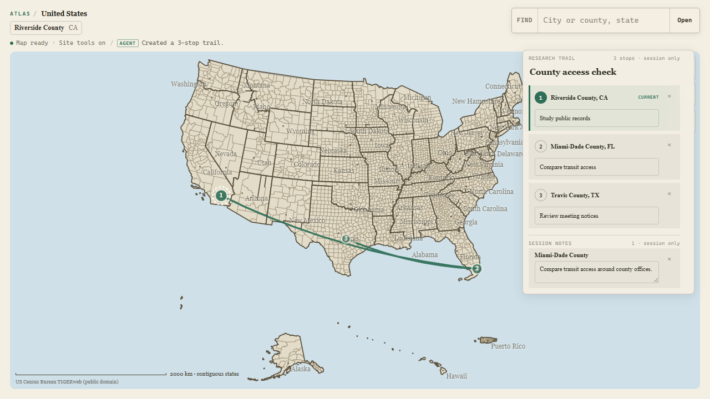

# Atlas WebMCP

Atlas is a shared geographic canvas. A person explores U.S. counties on the map while an agent reads and changes the same live session through browser-native WebMCP tools.

No login. No saved profile. One map, one research session.

Live build: [atlas-webmcp-production.up.railway.app/explore](https://atlas-webmcp-production.up.railway.app/explore)



## The 20-second shared-control test

1. Ask ChatGPT: “Create a civic research trail through Riverside County, California; Miami-Dade County, Florida; and Travis County, Texas.”
2. Select stop 2 on the map yourself.
3. Ask: “What place is open now?” ChatGPT reads the human-updated map and answers from the same visible session.

The point is turn-taking on one map—not a chatbot beside a map.

## What the candidate does

- Opens a nationwide Census-backed county map at `/` and `/explore`.
- Lets a person pan, zoom, drill into counties, follow breadcrumbs, and find a U.S. city or county with the keyboard.
- Preserves ambiguity. `Springfield` returns labeled candidates instead of silently choosing one.
- Registers exactly five imperative WebMCP tools from the top-level page.
- Shows agent activity and every write in the same interface the person is using, including a numbered national trail overview.
- Keeps notes and research trails in the current browser session only.
- Falls back to a complete normal map when WebMCP is unavailable.

## The five tools

| Tool | Effect |
|---|---|
| `get_map_state` | Reads the visible location, selection, recent notes, and active trail. |
| `search_places` | Searches the bounded Census-backed place index without changing the map. |
| `open_place` | Resolves one place and opens it visibly. Ambiguous names return candidates without mutation. |
| `add_map_note` | Resolves a place, opens it, and adds one visible session-only note. |
| `create_map_trail` | Resolves every stop first, then atomically shows one editable 2-5 stop trail on the national map. |

Human controls and tool callbacks share one `AtlasMapController`. Write calls resolve only after the matching map revision is visible. A canceled, failed, or superseded transition cannot report success.

ChatGPT sees concise human-readable Site Tools titles and intent-specific descriptions. Successful writes return the visible map effect; ambiguous or failed writes explicitly report that the map stayed unchanged, so the conversation can recover without guessing.

## Run locally

Requirements: Node.js 22.12 or newer, pnpm 11, Git, and Chrome for the WebMCP smoke gate.

```powershell
pnpm install --frozen-lockfile
pnpm build:atlas-plates
pnpm dev
```

Open:

- `http://127.0.0.1:8787/` for the top-level judge route.
- `http://127.0.0.1:8787/explore` for the equivalent explicit route.
- `http://127.0.0.1:8787/preview` only for the fenced legacy widget preview.

The challenge route feature-detects `document.modelContext?.registerTool`. A normal browser shows `Map ready · Site tools not detected` and keeps the human map fully usable.

Current WebMCP setup details live in the [OpenAI Site Tools documentation](https://learn.chatgpt.com/docs/webmcp), [Chrome imperative API guide](https://developer.chrome.com/docs/ai/webmcp/imperative-api), and [WebMCP draft](https://webmachinelearning.github.io/webmcp/).

Atlas's source-pinned standards review is recorded in [docs/webmcp/OFFICIAL_COMPATIBILITY.md](docs/webmcp/OFFICIAL_COMPATIBILITY.md). It separates the page-native Site Tools path used by the challenge from a remote MCP/plugin integration and maps the current ChatGPT subset to executable Atlas checks.

## Verify the candidate

```powershell
pnpm verify:webmcp
pnpm typecheck
pnpm build
pnpm eval:webmcp:smoke
```

`pnpm verify:webmcp` covers the exact-five contract, schemas, annotations, output bounds, shared-controller path, ambiguity, cancellation, atomic trails, projected county centers, top-level registration, all-or-none rollback, route fencing, normal-browser feature detection, and evaluation-fixture drift. `pnpm eval:webmcp:smoke` starts the built judge route, enables Chrome WebMCP, executes all five real tools without a model or API key, and checks visible completion plus mutation-safe failures.

Model-selection runs are credentialed, explicit gates:

```powershell
$env:ATLAS_WEBMCP_EVAL_MODEL = "openai:gpt-5-mini"
$env:OPENAI_API_KEY = "..."
pnpm eval:webmcp:static
pnpm eval:webmcp:browser
```

Both model commands run each case three times, require at least 90% correct tool/argument trajectories, and reject any critical write-selection or atomicity failure. See [docs/webmcp/EVALS.md](docs/webmcp/EVALS.md) for provider options and evidence boundaries.

For the deployed judge route, one command runs HTTPS/page preflight and the real Chrome WebMCP journey against the same URL:

```powershell
$env:ATLAS_CHATGPT_URL = "https://atlas-webmcp-production.up.railway.app/explore"
pnpm e2e:chatgpt
```

Run `pnpm e2e:chatgpt:session` first to create an ignored, timestamped ChatGPT desktop runbook, prefilled transcript, and evidence folder. The consolidated report keeps automated protocol proof, the real ChatGPT transcript, and the model threshold as separate evidence fields. See [docs/webmcp/CHATGPT_E2E.md](docs/webmcp/CHATGPT_E2E.md) for the complete session contract and the Grok 4.6 adversarial lane.

The deterministic local gates currently pass. Chrome 152 WebMCP proof covers exact-five discovery, 9/9 official smoke steps, 15 deeper browser executions, visible trail rendering, keyboard marker navigation, ambiguity recovery, atomic failure, refresh/route registration, and zero console errors. Model-score and real ChatGPT built-in-browser acceptance remain separate credentialed or external gates.

## Challenge-period delta

Atlas existed before the WebMCP Challenge opened on August 25, 2026. The submission delta begins at baseline commit `b6f2f8213a9acef3629a2c5f9f84cebab32fea56` and adds the no-login top-level route, shared live controller, exact-five WebMCP surface, visible activity, session notes, atomic trails, verifier, and judge-path accessibility work.

See [CHALLENGE_DELTA.md](CHALLENGE_DELTA.md) for the capability ledger and [WEBMCP_STATE.md](WEBMCP_STATE.md) for exact commands, results, screenshots, and current gates.

## Deliberate boundaries

The challenge experience requires no account and keeps its research artifacts session-only. It makes no generated-street or building claims. Tool output excludes raw geometry, large scene objects, credentials, and third-party payloads.

The owner-selected Apache-2.0 license is applied only to the sanitized challenge edition. Public source visibility and Devpost submission still require explicit owner approval. The current historical repository is not safe to publish as-is; use the audited sanitized-release path in [docs/webmcp/RELEASE_PACKET.md](docs/webmcp/RELEASE_PACKET.md).

## Submission materials

- [Devpost copy and evidence map](docs/webmcp/SUBMISSION.md)
- [Under-three-minute video script](docs/webmcp/VIDEO_SCRIPT.md)
- [Demo production and truth boundary](docs/webmcp/VIDEO_PRODUCTION.md)
- [Locked narration](docs/webmcp/VIDEO_NARRATION.txt) and [captions](docs/webmcp/VIDEO_CAPTIONS.srt)
- [Deadline-aware Devpost handoff](docs/webmcp/DEVPOST_HANDOFF.md)
- [Owner-gated release packet](docs/webmcp/RELEASE_PACKET.md)
- [Evaluation guide and thresholds](docs/webmcp/EVALS.md)
- [ChatGPT Site Tools acceptance script](docs/webmcp/CHATGPT_ACCEPTANCE.md)
- [Live ChatGPT end-to-end environment](docs/webmcp/CHATGPT_E2E.md)
- [Bounded Ralph release loop](docs/webmcp/RALPH_RELEASE_LOOP.md)
- [Live release product-design audit](docs/webmcp/RELEASE_PRODUCT_DESIGN_AUDIT.md)
- [HCI, cognitive-accessibility, plain-language, and motion operating manual](docs/webmcp/HCI_OPERATING_MANUAL.md)
- [Official WebMCP and ChatGPT compatibility record](docs/webmcp/OFFICIAL_COMPATIBILITY.md)
- [Official challenge page](https://webmcp.devpost.com/)
- [Official rules](https://webmcp.devpost.com/rules)
