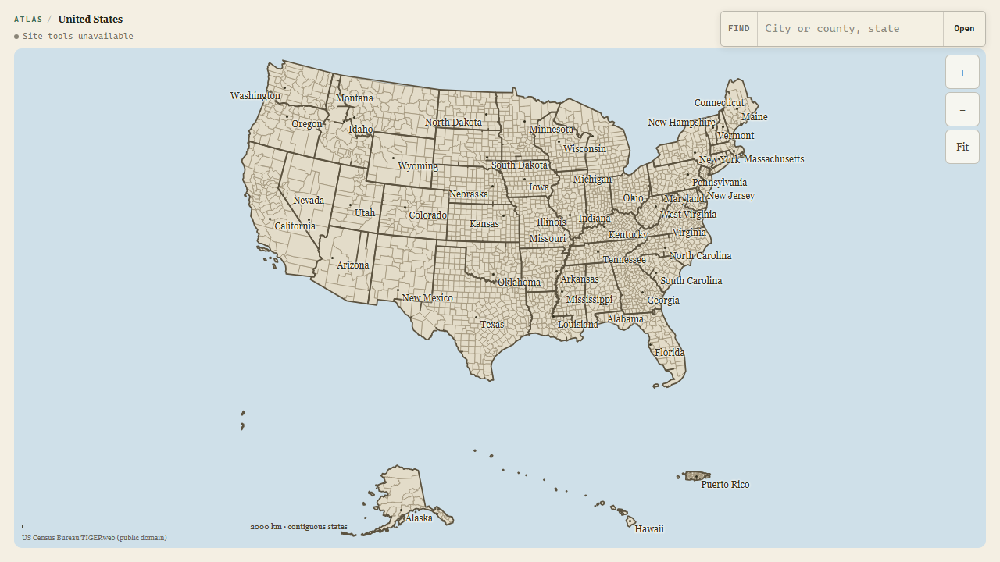

# Atlas WebMCP

Atlas is a shared geographic canvas. A person explores U.S. counties on the map while an agent reads and changes the same live session through browser-native WebMCP tools.

No login. No saved profile. One map, one research session.



## What the candidate does

- Opens a nationwide Census-backed county map at `/` and `/explore`.
- Lets a person pan, zoom, drill into counties, follow breadcrumbs, and find a U.S. city or county with the keyboard.
- Preserves ambiguity. `Springfield` returns labeled candidates instead of silently choosing one.
- Registers exactly five imperative WebMCP tools from the top-level page.
- Shows agent activity and every write in the same interface the person is using.
- Keeps notes and research trails in the current browser session only.
- Falls back to a complete normal map when WebMCP is unavailable.

## The five tools

| Tool | Effect |
|---|---|
| `get_map_state` | Reads the visible location, selection, recent notes, and active trail. |
| `search_places` | Searches the bounded Census-backed place index without changing the map. |
| `open_place` | Resolves one place and opens it visibly. Ambiguous names return candidates without mutation. |
| `add_map_note` | Resolves a place, opens it, and adds one visible session-only note. |
| `create_map_trail` | Resolves every stop first, then creates one visible editable 2-5 stop trail atomically. |

Human controls and tool callbacks share one `AtlasMapController`. Write calls resolve only after the matching map revision is visible. A canceled, failed, or superseded transition cannot report success.

## Run locally

Requirements: Node.js 18 or newer, pnpm 11, and Git.

```powershell
pnpm install --frozen-lockfile
pnpm build:atlas-plates
pnpm dev
```

Open:

- `http://127.0.0.1:8787/` for the top-level judge route.
- `http://127.0.0.1:8787/explore` for the equivalent explicit route.
- `http://127.0.0.1:8787/preview` only for the fenced legacy widget preview.

The challenge route feature-detects `document.modelContext?.registerTool`. A normal browser shows `Site tools unavailable` and keeps the human map fully usable.

Current WebMCP setup details live in the [OpenAI Site Tools documentation](https://learn.chatgpt.com/docs/webmcp), [Chrome imperative API guide](https://developer.chrome.com/docs/ai/webmcp/imperative-api), and [WebMCP draft](https://webmachinelearning.github.io/webmcp/).

## Verify the candidate

```powershell
pnpm verify:webmcp
pnpm typecheck
pnpm build
```

`pnpm verify:webmcp` covers the exact-five contract, schemas, annotations, output bounds, shared-controller path, ambiguity, cancellation, atomic trails, top-level registration, all-or-none rollback, route fencing, and normal-browser feature detection.

The full local gates currently pass. Browser proof covers 1280x720 and 390x844, keyboard place finding, ambiguity recovery, fallback behavior, accessibility landmarks, 44px visible mobile controls, and zero horizontal overflow. Real ChatGPT built-in-browser discovery remains a separate external acceptance gate.

## Challenge-period delta

Atlas existed before the WebMCP Challenge opened on August 25, 2026. The submission delta begins at baseline commit `b6f2f8213a9acef3629a2c5f9f84cebab32fea56` and adds the no-login top-level route, shared live controller, exact-five WebMCP surface, visible activity, session notes, atomic trails, verifier, and judge-path accessibility work.

See [CHALLENGE_DELTA.md](CHALLENGE_DELTA.md) for the capability ledger and [WEBMCP_STATE.md](WEBMCP_STATE.md) for exact commands, results, screenshots, and current gates.

## Deliberate boundaries

The challenge experience requires no account and keeps its research artifacts session-only. It makes no generated-street or building claims. Tool output excludes raw geometry, large scene objects, credentials, and third-party payloads.

Repository visibility, license selection, public deployment, and Devpost submission require explicit owner approval. The current repository history is not safe to publish as-is; use the audited sanitized-release path in [docs/webmcp/RELEASE_PACKET.md](docs/webmcp/RELEASE_PACKET.md).

## Submission materials

- [Devpost copy and evidence map](docs/webmcp/SUBMISSION.md)
- [Under-three-minute video script](docs/webmcp/VIDEO_SCRIPT.md)
- [Owner-gated release packet](docs/webmcp/RELEASE_PACKET.md)
- [Official challenge page](https://webmcp.devpost.com/)
- [Official rules](https://webmcp.devpost.com/rules)
