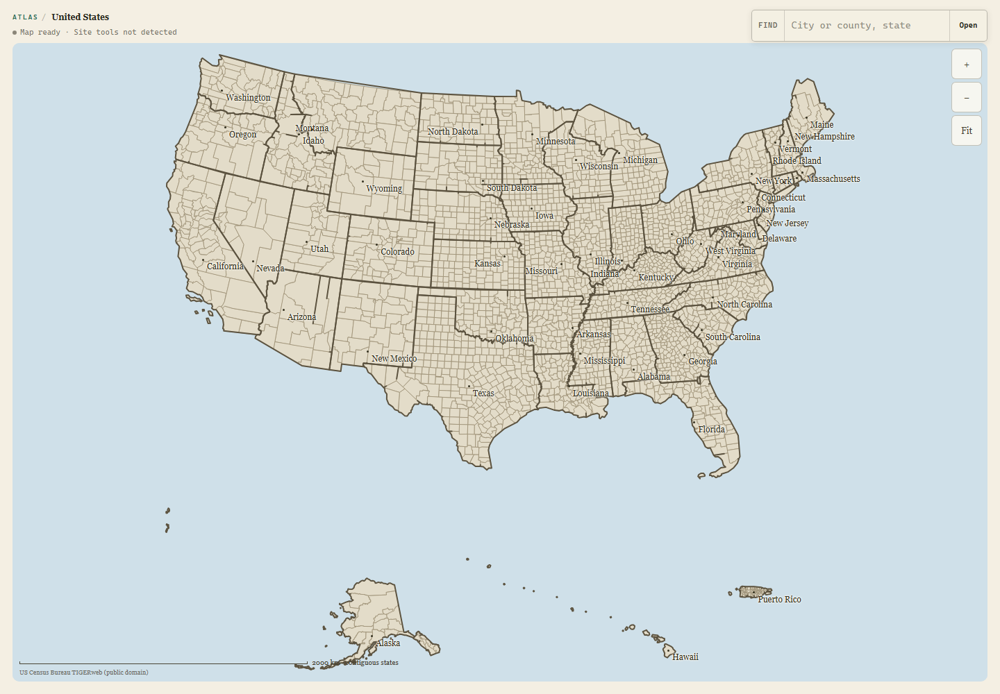
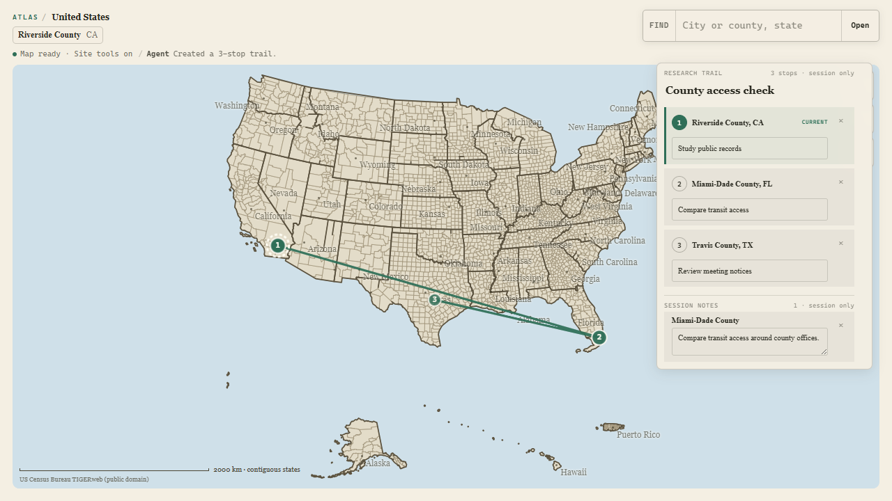
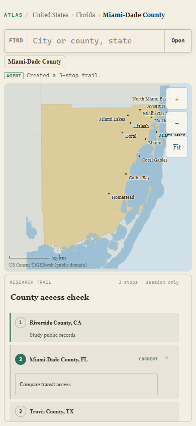
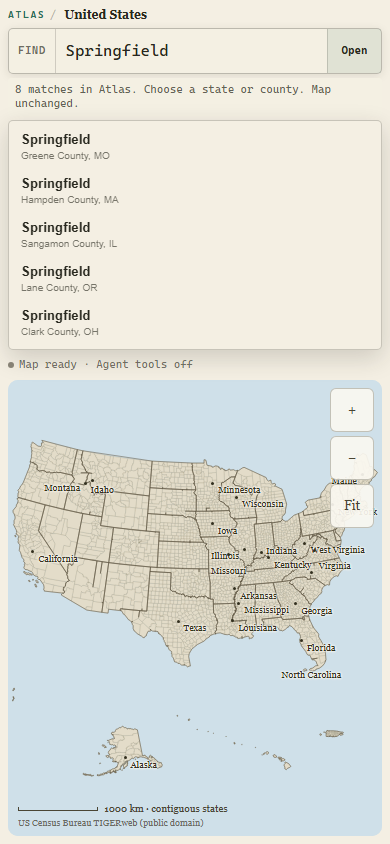
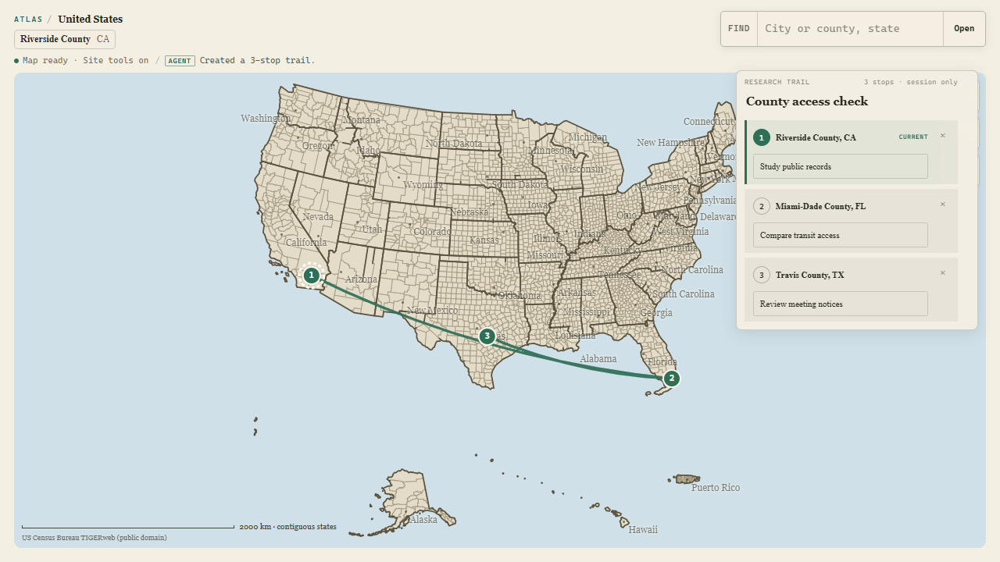
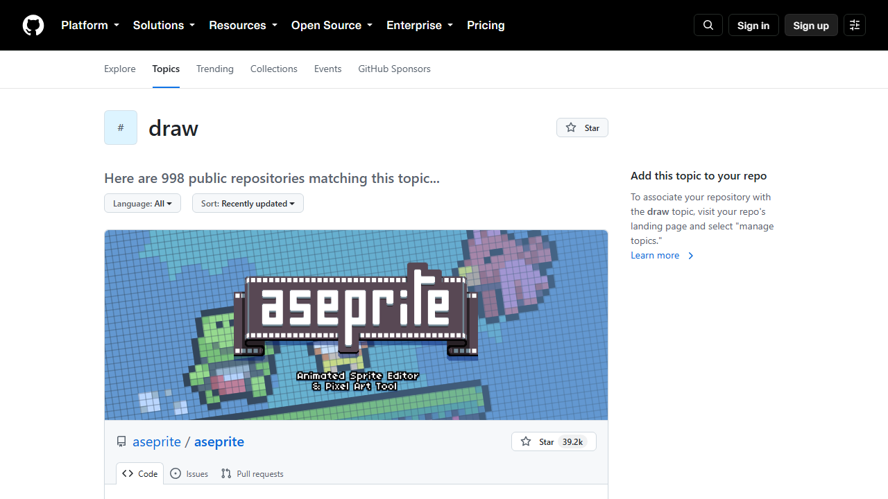

# Atlas judge-presentation Product Design audit

**Run:** September 3, 2026

**Surface:** local production build at `/explore`, with comparison against deployed candidate `39d1e141`

**Question:** Can a judge understand the human-Agent handoff in twenty seconds, and does the result feel like an authored field atlas rather than a generic map dashboard?

## Verdict

Pass. The map remains the product, the ChatGPT write becomes a visible geographic object, and the person can take over through the numbered marker or research rail. Two medium presentation defects were found and resolved: the route read as a chart-like straight polyline, and the agent origin was visually buried in status copy. The current build uses a restrained curved ink path and a compact `AGENT` stamp inside the existing activity line. No new panel, drawing mode, dependency, or tool was added.

Outstanding findings: **P0 0 · P1 0 · P2 0**.

## Flow review

### 1. Enter the national atlas — healthy

The U.S. county map owns the screen. Search, location, and controls remain quiet and immediately usable without login or onboarding.

### 2. Ask ChatGPT for a three-county trail — healthy, improved

| Before | After |
| --- | --- |
|  |  |

The exact same resolved county centers now connect with a deterministic alternating curve. It reads as a field-atlas annotation without implying turn-by-turn directions. Numbered endpoints remain exact, the rail stays editable, and the existing activity line now makes agent authorship legible at a glance.

### 3. Take over as a person — healthy

Selecting stop 2 by hand opens Miami-Dade County through the same controller. The mobile view keeps the county map useful, retains every trail stop, and exposes only the active prompt editor and removal action.

### 4. Resolve an ambiguous place — healthy

`Springfield` produces eight labeled candidates and says `Map unchanged.` The page measured `scrollWidth = innerWidth = 390`; search results remain above a usable national map, and the clean console produced no messages after the flow began.

### 5. Respect reduced motion — healthy

The complete base route and all markers remain visible when motion is reduced. The smoke gate confirms route, marker, pin, active-ring, and activity animations compute to `none`.

### 6. Explain the handoff to a judge — healthy

The README and Devpost testing instructions now use one short sequence: ChatGPT creates Riverside → Miami-Dade → Travis; the person selects stop 2; ChatGPT answers `What place is open now?` from the human-updated state. The product thesis is explicit: turn-taking on one map, not a chatbot beside a map.

## Reference disposition

The linked [GitHub draw topic](https://github.com/topics/draw?o=desc&s=updated) was used only as interaction reference. Atlas borrows the idea that creation should happen directly on the working surface. It does not add a freehand toolbar, canvas editor, third-party drawing runtime, or sixth WebMCP tool.

## Verification

- `pnpm test:webmcp-geometry` — 2/2 pass.
- `pnpm verify:webmcp` — 39/39 pass; exact five tools preserved.
- `pnpm typecheck` — pass.
- `pnpm build` — pass.
- `pnpm eval:webmcp:smoke` — Chrome 152, 9/9 official steps, 15 deeper executions, desktop/mobile/reduced-motion captures.
- gstack browser — local production route `200`, exact `390x844` ambiguity flow, no horizontal overflow, no new console messages.
- `git diff --check` — pass before audit recording.

## One next action

Project this green presentation slice into a fresh sanitized candidate and repeat the clean-clone gate before any owner-gated deployment decision.
