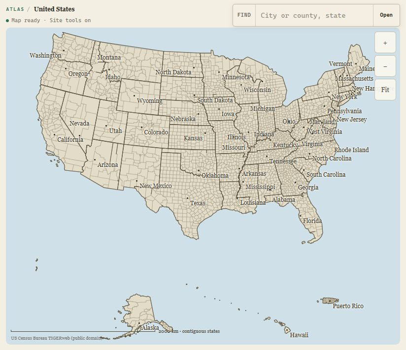
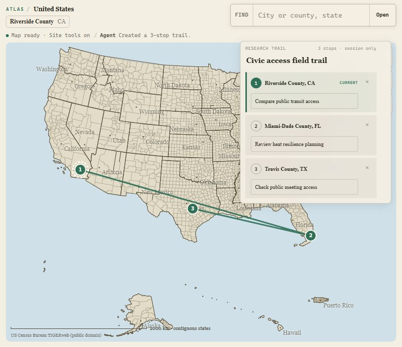
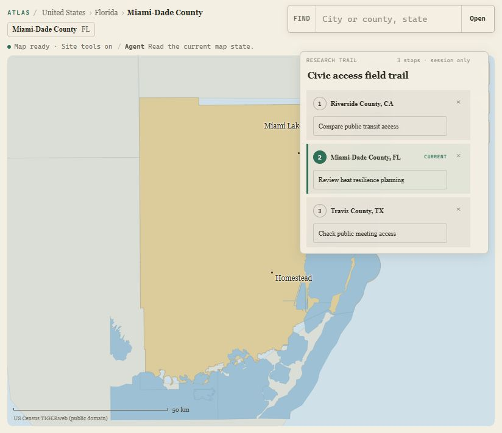
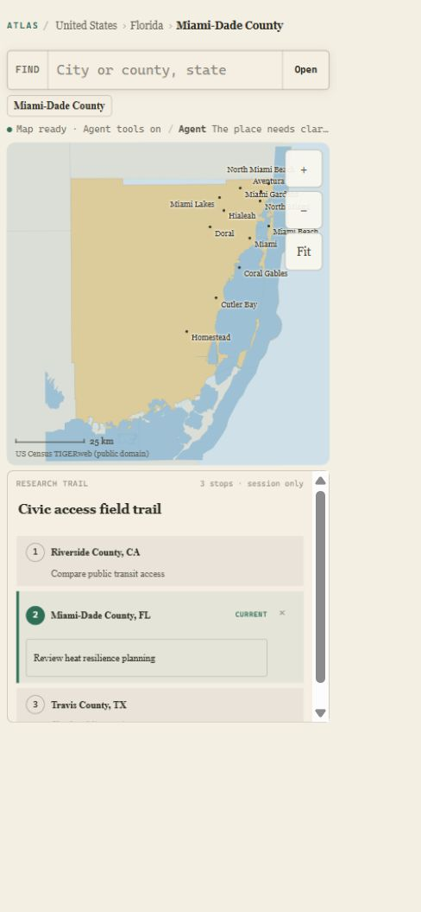
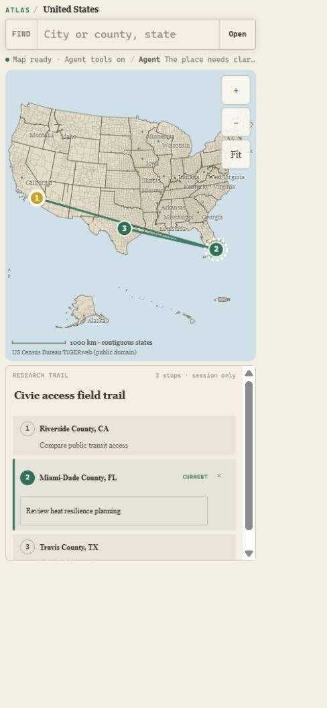
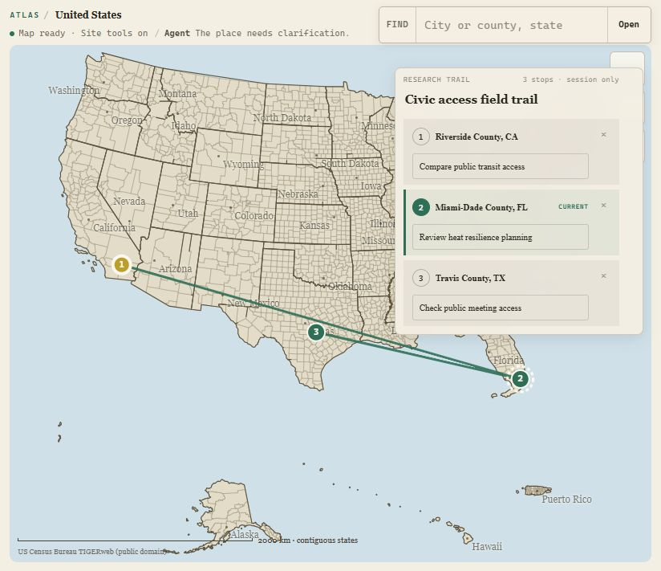

# Atlas judge-facing Product Design audit

Date: August 31, 2026

Surface: local `/explore` candidate at content commit `b2ddedd0`

Audit mode: combined UX and accessibility triage

## Audit scope

This run reviewed the experience a WebMCP Challenge judge is likely to see:

1. Land on Atlas with no prior session.
2. Ask an agent to create a three-stop civic research trail.
3. Click a trail stop as a person, then let the agent read that same map state.
4. Ask for an ambiguous place and verify that the map does not mutate.
5. Review the active trail at an exact CSS viewport of 390 by 844.
6. Check visible keyboard focus and browser errors.

The audit used the in-app browser, the page's actual WebMCP tools, current-run screenshots, and the current challenge criteria. It did not use prior screenshots as audit evidence.

## Judge goal and accessibility target

A judge should understand within 15 seconds that Atlas is a shared map for a person and an agent, then see one unmistakable agent-created visual result without reading implementation documentation.

The target is a coherent keyboard-usable, reduced-motion-safe, responsive experience. This report does not claim WCAG conformance.

## Challenge-criteria read

The current challenge scores WebMCP leverage, execution, potential impact, and creativity and ambition. Atlas's strongest evidence for each is:

| Criterion | Strongest current proof | Remaining UI risk |
| --- | --- | --- |
| WebMCP leverage | One agent call creates a visible ordered route, editable research rail, and shared state that a human can change. | The fresh page does not tell a judge what useful agent action to try. |
| Execution | Exact-five registration, visible completion, ambiguity-safe writes, keyboard stops, mobile reflow, and zero browser errors in this run. | The most important status sentence clips at 390px and the mobile rail has a nested scrollbar. |
| Potential impact | The trail holds concrete civic prompts for transit, heat resilience, and public meeting access. | The first screen still reads as a map explorer before the agent acts. |
| Creativity and ambition | The person and agent co-navigate one geographic canvas instead of exchanging detached map answers. | Extra panels, tutorials, or a sixth tool would weaken the idea rather than strengthen it. |

## Flow evidence

### 1. Fresh judge entry: needs tightening

Strengths: the map dominates, search is obvious, the page is no-login, and there is no generic dashboard shell.

Risk: `Site tools on` is implementation language. Nothing on the first screen tells a judge to ask the agent for the distinctive trail action.

### 2. Agent-created civic trail: strong

Strengths: the result is immediate and visual. Numbered markers, one route, a clear title, editable prompts, session scope, and `Agent Created a 3-stop trail` all reinforce the shared-canvas idea.

Risk: none that should block release. The right rail covers part of the map at this narrow desktop width, but the route remains legible and the overlay is the clear focal event.

### 3. Human marker to agent state read: strong

Strengths: selecting stop 2 opens Miami-Dade County, updates the breadcrumb, marks the same rail row current, and the agent then reads `miami-dade-fl` with `activeIndex: 1`. This is the best proof that the person and agent share one controller.

Risk: the story depends on the demo explicitly showing the follow-up state read. The page alone cannot prove what the chat received.

### 4. Ambiguous Springfield: needs tightening

Strengths: eight candidates are returned to the chat and the prior county and trail stay unchanged.

Risk: the page only says `The place needs clarification.` It does not say how many matches were found or make the no-mutation guarantee visible. The browser should summarize `8 matches · choose a state · map unchanged`; the candidate list should remain in chat.

### 5. Exact 390 by 844 active stop: needs tightening

Strengths: the map stays primary, the active stop has a non-color current label, only one editor and one removal action are visible, and inactive prompts remain readable.

Risks: the activity line clips before the clarification message completes. Small status and metadata text is difficult to scan. The nested research-panel scrollbar feels like a desktop control transplanted onto mobile.

### 6. Exact 390 by 844 national trail: healthy with one interaction issue

Strengths: all three markers and the connecting path appear in the first viewport. The research rail starts immediately below the map, the document width equals the 390px CSS viewport, and the active editor/removal count remains one.

Risk: the rail's internal scroll hides part of stop 3 even though normal page scrolling would be simpler and more expected on a phone.

### 7. Keyboard focus: healthy

Strengths: trail markers have button semantics, accessible stop names, a visible non-color focus treatment, and predictable ordered navigation.

Limit: this screenshot does not replace screen-reader testing, 200 percent zoom testing, or contrast measurement.

## Priority triage

### P0 before the next deployment

1. Replace the supported empty-state copy with one short, useful instruction: `Agent tools ready · Try: build a 3-stop civic trail.` Keep it in the existing status line. Do not add a card, modal, or tutorial.
2. Make ambiguity safety visible: `8 matches · choose a state · map unchanged.` Keep the full candidate list in ChatGPT.
3. Give mobile a deliberately short activity summary or allow the summary to wrap. No meaning-bearing sentence should end in an ellipsis at 390px.

### P1 before video capture

1. Remove the nested mobile scrollbar from the research rail. Let the page scroll naturally after the map while keeping only the active stop editable.
2. Raise the smallest mobile status and metadata text one step without enlarging the whole interface.
3. Record the demo in a width where the map and research rail both read clearly. Use the exact sequence: create trail, human marker click, agent state read, ambiguous Springfield, deliberate resolution.

### P2 only if the P0 and P1 work remains green

1. Recheck the local preview title encoding in the release server. The current local browser title displayed mojibake, while the deployed release tab did not.
2. Consider shortening `session only` metadata to one consistent placement if it competes with trail title space at narrow widths.

## Do not add

- No sixth WebMCP tool.
- No onboarding modal or guided tour.
- No ChatGPT logo or platform-specific chrome inside Atlas.
- No tool-debug console on the judge route.
- No larger or looping animation.
- No extra card stack that shrinks the map.

## Recommended judge sequence

1. Start on the fresh national map. The status line supplies one concrete trail prompt.
2. Ask ChatGPT to build the three-stop civic trail. Pause on the route and rail.
3. Click stop 2 directly on the map. Ask ChatGPT what is currently open.
4. Ask to open Springfield. Show `8 matches · map unchanged`, then choose Missouri.
5. Add one place-bound note and show it in the same research rail.
6. Briefly show the exact 390px layout and reduced-motion behavior.

## Evidence limits

- Screenshots were captured from the current local candidate at 824 by 711 and an exact 390 by 844 CSS viewport. High-density screenshots have larger physical pixel dimensions.
- The in-app browser reported no console warnings or errors during the audited flow.
- The current run invoked `create_map_trail`, `get_map_state`, and ambiguous `open_place` through the page's real WebMCP surface.
- This run did not perform a real ChatGPT conversation transcript, screen-reader session, automated color-contrast calculation, 200 percent zoom pass, or production deployment check.
