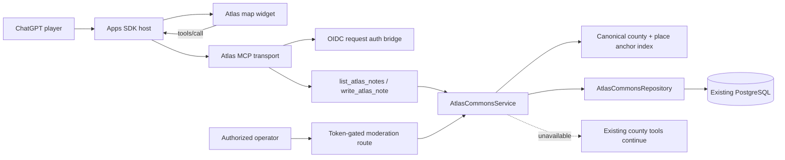
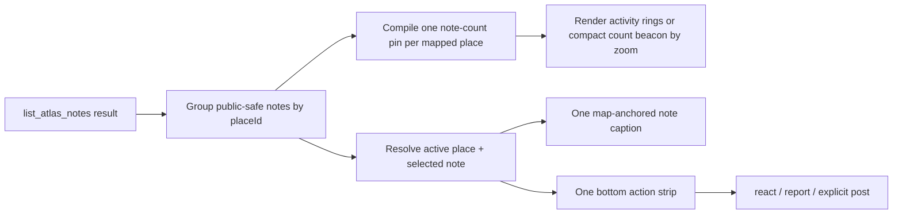

# Atlas ALL Public Notes Architecture

Status: Accepted for `postalpha-0.81c-atlas-all-public-notes-foundation`; extended by `postalpha-0.81d-atlas-commons-map-radar`

Companion requirements: `docs/ATLAS_ALL_PUBLIC_NOTES_SPEC.md`

## Requirements summary

Atlas needs a shared, moderated public-note layer without becoming a social dashboard. Public reads must work without identity; mutations and owner-only pending reads must use the existing OIDC bearer boundary. The implementation must reuse the current Node/MCP/React/Pixi/Postgres stack, stay default-off, fail independently from the map, and leave the frozen release candidate and production unchanged.

The foundation targets a 30-note default response, 100-note hard cap, sub-64-KiB public payload, and a warm-database p95 below 350 ms. It does not claim a production SLO until load and operational evidence exist.

## System shape



The map widget calls the same MCP tools through the Apps SDK `tools/call` bridge. It does not call a parallel private REST API, embed a database credential, or infer identity from iframe state.

## Components

### Request authentication bridge

`handleMcp` verifies an optional bearer token with the existing issuer/audience/JWKS verifier before forwarding the request to the MCP transport. A valid result is attached as MCP `AuthInfo`, including the verified subject in server-owned `extra` data. Anonymous requests are still allowed because public note reads and all existing Atlas map tools are public.

Commons callbacks consume only this verified `AuthInfo`. They never accept a subject, email, role, or scope from tool arguments or model text.

### AtlasCommonsService

The service owns validation, authorization, pseudonym generation, anchor verification, idempotency, report-threshold behavior, and the public-field allowlist. Transport handlers remain thin.

The service is constructed only when the commons flag, database, OIDC settings, and pseudonym secret are configured. Tool registration depends only on the explicit feature flag so a misconfigured enabled environment reports a narrow `COMMONS_UNAVAILABLE` error instead of silently changing behavior.

### Canonical anchor resolver

Posting accepts only anchors Atlas can already draw:

- national boards use `town-anchor-<Census place GEOID>` and the label from the committed county town-anchor index;
- Riverside's full scene uses compiled place/node IDs and their committed display labels.

The server derives the canonical label from these sources. A client-supplied label is treated as a display hint only and is never trusted as the stored identity. Arbitrary coordinates and provider place IDs are rejected.

### AtlasCommonsRepository

A narrow repository interface supports both an in-memory test adapter and a Postgres adapter:

- create or retrieve an idempotent pending note;
- list visible notes and owner-visible pending notes;
- set/unset one positive reaction per identity;
- record one report per identity and hide at threshold;
- transition moderation state with an audit entry;
- check readiness.

The repository owns SQL and transaction boundaries. The service owns policy.

### Map widget

The widget receives commons availability in tool-result `_meta`, then uses `tools/call` to load or mutate notes. `ALL / NEARBY / MINE` is a small overlay control. Public markers reuse the map's note-pin visual language with a distinct public label. Detail and actions appear only in the existing selected-place contextual surface.

The map-radar slice keeps the server contract note-granular and adds a derived presentation layer in the widget:



`HOT / NEW` remains a server sort choice, stored in widget state and passed to `list_atlas_notes`; the client does not invent a second ranking algorithm. The selected-note ID is ephemeral view state. When refreshed results remove that note, selection falls back deterministically to the first note at the active place. The renderer receives only public-safe caption fields and the compiled scene; it never receives provider identity, moderation evidence, OAuth subject, or email.

The bottom strip renders one note, not an array. Previous/next controls change the selected note within the already-loaded bounded page. The public composer is collapsed until the player chooses `Leave public note`, which preserves map area and makes the public/private boundary deliberate.

Private/session notes remain in widget state. No migration, bulk promotion, or silent sync runs.

### Operator moderation route

A separate server route accepts `approve` or `remove` for one note. It requires a server-configured operator bearer token, compares credentials without timing-sensitive string equality, applies the transition through the service, and records an audit row. It is intentionally absent from the player-facing MCP tool list.

This is an operational foundation, not a moderator dashboard.

## Data model

### `atlas_public_notes`

| Column | Purpose |
| --- | --- |
| `id` | Application-generated UUID text |
| `owner_user_id` | Private FK to existing `users` row |
| `author_handle` | Public pseudonym snapshot |
| `county_slug` | Canonical Atlas county |
| `place_id` | Canonical Atlas anchor ID |
| `place_label` | Canonical committed display label |
| `body` | Trimmed plain text, maximum 240 characters |
| `moderation_status` | `pending`, `visible`, or `removed` |
| `client_request_id` | Per-owner idempotency key |
| timestamps | created, published, removed |

Unique `(owner_user_id, client_request_id)` prevents duplicate posts. Indexed `(moderation_status, county_slug, place_id, created_at)` supports the primary read paths.

### `atlas_note_reactions`

Primary key `(note_id, owner_user_id)`. V1 has one positive reaction kind. Counts are derived from rows to avoid counter drift at this scale.

### `atlas_note_reports`

Primary key `(note_id, reporter_user_id)`, plus a short allowlisted reason and timestamp. A transaction inserts the unique report, counts unique reporters, and moves a visible note to `removed` with reason `report_threshold` when the configured threshold is reached.

### `atlas_note_moderation_events`

Append-only note ID, prior status, next status, operator label, and timestamp. It stores no bearer credential.

## Ranking and pagination

`new` orders by publication time descending, then ID descending.

`hot` uses a deterministic query-time score:

```text
reaction_count * 4 - report_count * 8 - age_hours / 12
```

Ties resolve by publication time and ID. The first implementation uses an HMAC-signed opaque cursor containing versioned sort keys plus mode, sort, county, and place scope. A cursor cannot be edited or replayed against a different list scope. It does not add Redis or a search service. If evidence later shows this query is a bottleneck, a materialized score or cache can be introduced without changing the tool contract.

Write-quota checks and mutations share a transaction guarded by a per-identity Postgres advisory lock. The repository checks idempotent state first, then counts recent accepted actions, then mutates and writes the action row before commit. This keeps retries unchanged and prevents concurrent new writes from stepping over the hourly ceiling.

## Identity and privacy boundary

- OIDC subject and email remain in the private `users` table.
- A public handle is `Atlas-` plus a 16-character uppercase HMAC-derived suffix using `ATLAS_COMMONS_PSEUDONYM_SECRET`.
- The service stores the handle snapshot with each note and never returns the subject or owner ID.
- Changing the secret affects handles for future notes; it does not rewrite historical public authorship.
- Public result objects are constructed by an allowlist mapper, not by spreading repository rows.

## Feature and configuration gates

| Variable | Effect |
| --- | --- |
| `ATLAS_COMMONS_ENABLED` | Registers commons tools and exposes the map control when `true` |
| `DATABASE_URL` | Supplies durable storage; no in-memory production fallback |
| `ATLAS_OIDC_*` | Verifies identities for mutations and owner-only reads |
| `ATLAS_COMMONS_PSEUDONYM_SECRET` | Produces stable non-provider public handles |
| `ATLAS_COMMONS_OPS_TOKEN` | Enables the moderation route |
| `ATLAS_COMMONS_REPORT_THRESHOLD` | Unique reports required to auto-hide; bounded server-side |

All are empty/off in `.env.example`. Production behavior is therefore unchanged by merging code alone.

## Failure modes

| Failure | User impact | Containment |
| --- | --- | --- |
| Postgres unavailable | Commons reads/writes unavailable | Existing map tools and session notes continue; narrow error and readiness state |
| OIDC unavailable or invalid token | Public reads continue; protected actions fail | OAuth challenge; no anonymous write fallback |
| Apps SDK `tools/call` rejected | Widget shows compact unavailable copy | ChatGPT can still call the tools directly; map remains operable |
| Duplicate client retry | No duplicate public note | Unique owner/request key returns original row |
| Concurrent duplicate reaction/report | One row per identity | Database primary key and idempotent repository response |
| Report threshold crossed | Note disappears from public reads | Audit-preserving status transition; operator can review |
| Unknown/stale map anchor | Post rejected | Server checks committed anchor sources before persistence |
| Missing operator token | Moderation route unavailable | No weak fallback and no moderator MCP surface |
| Ranking query slows | Commons layer degrades | Hard caps and indexes first; add cache only after evidence |
| Result refresh removes the selected note | Caption and strip could point at stale data | Reconcile selection by note ID, then fall back to the first note at the active place |
| Many notes share one place | Overlapping markers and unreadable trays | Aggregate by canonical `placeId`; render one count beacon and one selected note |
| Mobile composer would cover the map | Core map loop becomes inaccessible | Keep composer collapsed by default, enforce bounded bottom-sheet height, and preserve 44-pixel actions without horizontal scroll |

## Observability

Structured events record operation name, outcome, duration, note status, and coarse county slug. Logs exclude body text, token, subject, email, client request ID, and report reason. Readiness exposes only enabled/configured/database-ready booleans and public-safe counts.

## Rollout and rollback

1. Merge code with `ATLAS_COMMONS_ENABLED=false`.
2. Apply migration in a named non-production environment.
3. Configure mock/local OIDC and verify anonymous reads plus two-user isolation.
4. Enable in a staged environment with operator moderation and seed only test notes.
5. Run map/mobile/browser and MCP connector proof.
6. Obtain explicit owner, moderation, privacy/legal, and release approvals before any production enablement.

Rollback is setting `ATLAS_COMMONS_ENABLED=false` and restarting the service. The migration is additive and is not dropped during rollback; audit and note data remain intact. A removed tool surface reverts to the existing seven Atlas tools.

## Architecture decisions

### ADR-001: Extend the modular monolith

Status: Accepted

Context: Atlas already has one MCP/HTTP server, one widget, OIDC verification, and Postgres. Public notes require transactions and tight map integration but not independent scaling today.

Decision: Add an `atlasCommons` module inside the existing server with service and repository boundaries.

Alternatives considered:

- Separate social service: rejected because it adds deployment, auth, tracing, and failure coordination before load justifies it.
- Put SQL directly in MCP callbacks: rejected because it tangles policy, transport, and data access and weakens testability.

Consequences: Atlas keeps one deployable and low operational cost. The module boundary allows extraction later, but a server release remains the unit of deployment.

### ADR-002: Reuse PostgreSQL, not Redis or a document store

Status: Accepted

Context: Notes, unique reactions, reports, moderation transitions, ownership, and idempotency are relational and transaction-sensitive. Atlas already provisions Postgres and migrations.

Decision: Add relational tables and indexes to the existing database. Do not add a new datastore or cache in the foundation.

Alternatives considered:

- Redis as primary storage: rejected because durable moderation/audit state and relational uniqueness are the core needs.
- Document database: rejected because it adds an operator and consistency surface without solving a current scaling limit.
- Client-only notes: rejected because they cannot create a shared commons.

Consequences: The first implementation is operationally simple and strongly consistent. Global hot ranking may eventually need precomputation, but caps and indexes are sufficient for evidence gathering.

### ADR-003: Public reads, authenticated mutations

Status: Accepted

Context: The desired `r/all` feel depends on low-friction discovery. Posting and community actions require abuse controls and ownership. Existing Atlas authentication is optional at the transport edge.

Decision: Keep MCP transport authentication optional, allow anonymous `all` reads, and require verified `atlas:commons.read` for `mine` plus `atlas:commons.write` for all mutations.

Alternatives considered:

- Require login for every read: rejected because it hides the community layer and adds connector friction.
- Anonymous posting: rejected because rate limiting, moderation, and repeat-abuse handling would be too weak.
- Reuse Hosted Clawd scopes: rejected because public notes are a separate product boundary and should not revive or imply Hosted Clawd access.

Consequences: The staging connector exposes exactly the two Commons scopes. Anonymous map behavior remains intact.

### ADR-004: Pre-publication moderation with report auto-hide

Status: Accepted

Context: Public place-attached text can create abuse, PII, and local reputational risk. Atlas does not yet have a staffed real-time moderation system.

Decision: All posts start pending; only operator-approved rows are public. Unique reports auto-hide at a bounded threshold and preserve an audit trail.

Alternatives considered:

- Publish immediately then react: rejected for the first public-text foundation.
- Model-only approval: rejected because no model policy, evaluation set, or appeal workflow is approved.
- No public notes until a full moderator dashboard exists: rejected because a narrow operator route is enough to prove the product safely in staging.

Consequences: Public contribution has latency and operator work. Safety and reversibility are prioritized over instant posting.

### ADR-005: The map is the feed

Status: Accepted

Context: Atlas's product contract is a full-screen city/county map with tiny overlays. A conventional feed or card rail would split attention and erase the product's identity.

Decision: Render anchored public-note markers on the map and reveal detail contextually. Use one restrained `ALL / NEARBY / MINE` control.

Alternatives considered:

- Permanent vertical feed: rejected because it turns Atlas into a generic social dashboard and harms mobile map area.
- Separate commons page: deferred until national cross-county browsing has a proven use case.

Consequences: Discovery is spatial and distinctive. Cross-county `ALL` exists at the service contract but does not get a national feed UI in this slice.

### ADR-006: Aggregate presentation in the widget, preserve note-level service contracts

Status: Accepted

Context: Multiple approved notes can share a canonical place. Drawing each note as a separate pin creates overlap, while returning pre-clustered server records would couple storage and MCP contracts to one renderer and camera scale.

Decision: Keep `list_atlas_notes` note-granular. Group the bounded public-safe result by `placeId` inside the widget, compile one count pin per place, and choose radar-ring versus compact-beacon treatment from the existing renderer zoom. Show exactly one selected note in the contextual UI and expose previous/next navigation for the rest.

Alternatives considered:

- Server-side geographic clusters: rejected because V1 anchors are already canonical places and the server does not know the current camera transform.
- One marker and card per note: rejected because it creates overlap, feed behavior, and mobile overflow.
- A new map-overlay service or client dependency: rejected because the existing React/Pixi boundary can derive the presentation from capped tool results.

Consequences: No schema, migration, MCP output, or deployment topology changes are required. The client owns deterministic selection reconciliation and responsive presentation. The server remains the only authority for visibility, ranking, identity, and moderation.

## Review record

Requirements coverage, current repository architecture, Atlas Commons vision, Personal Atlas plan, and the current Atlas Release Command Center were cross-checked on 2026-07-20. The owner explicitly reopened public-note persistence. Any production enablement remains a later explicit approval.
