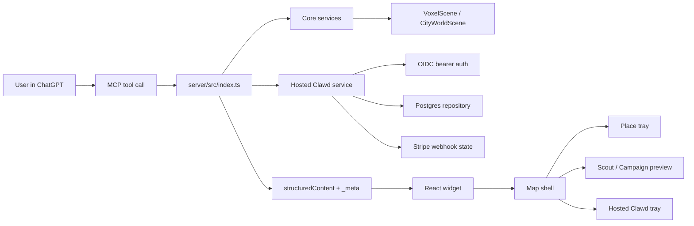
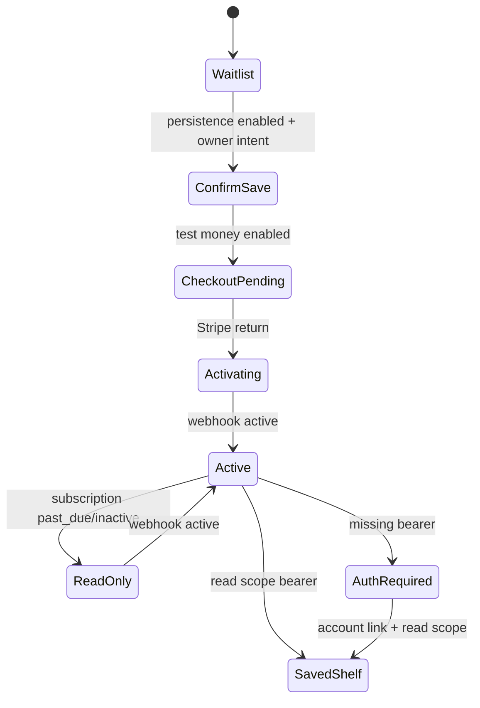

# Atlas Frontend / Backend Screen Plan

Date: 2026-07-05. Owner: acting CTO. Status: Scrum/product organization packet
for the current Hosted Clawd browser-proof lane and the parallel Fable visual
lane.

Atlas is one map-first ChatGPT app, not a routed SaaS site. Treat screens as
states of the full-screen voxel map shell. Every state needs a backend contract,
visual proof, mobile proof, safety boundary, and a named gate.

## Completeness rubric

| Level | Meaning | Required proof |
| --- | --- | --- |
| Green | Usable, verified, honest, and safe for the current phase. | Focused verifier, type/build where relevant, desktop and mobile screenshot when UI changed. |
| Local green | Implemented and verified locally, but not yet live/product-approved. | Local tests, local browser proof, source-of-truth docs. |
| In progress | Code or verifier exists, but one contract or proof is missing. | Exact blocker and next slice. |
| Planned | PRD/spec exists, no implementation claim. | Gate and owner decision. |
| Parked | Explicitly out of current phase. | Anti-scope note so agents do not wander. |

## Human touch standard

Atlas runs inside ChatGPT, often on an iPhone-sized screen. Treat touch,
keyboard, screen-reader, and reduced-motion behavior as product quality, not
compliance garnish.

Baseline:
- Primary touch targets use a 44x44 CSS pixel floor on mobile. WCAG's 24x24
  minimum is the fallback floor for dense map marks only, and dense map marks
  need an equivalent list/tray action when practical.
- Common actions use one tap. Swipes, drags, pinches, and map gestures need
  visible alternatives for core tasks.
- Hosted Clawd behaves like a modal bottom sheet: focus enters the sheet,
  Escape closes, status changes announce, and the map behind it does not become
  the only way to recover.
- The map must keep a keyboard-reachable place-selection path equivalent to
  tap/click selection.
- Reduced motion must cover both CSS animation and Pixi ambient motion. A
  static world is acceptable when the user asks for less motion.
- Browser proof for UI changes should include desktop, 390x844 mobile, no
  horizontal overflow, no console errors, a touch target smoke, a keyboard
  tab-order smoke, and a reduced-motion check.

Reference pressure:
- Apple HIG accessibility guidance: 44pt default iOS controls, simple gestures,
  alternatives to gesture-only actions, Dynamic Type, contrast, and Reduce
  Motion.
- WCAG 2.2 target-size guidance: 24x24 CSS pixels as the AA minimum, with
  equivalent controls for essential dense map targets.

## Current screen inventory

| Screen state | Frontend owner | Backend owner | Data contract | Completeness | Next action |
| --- | --- | --- | --- | --- | --- |
| ChatGPT entry / tool result mount | `web/src/bridge.ts`, `web/src/App.tsx` | seven MCP tools in `server/src/index.ts` | `structuredContent` + widget `_meta` | Green | Keep tool surface stable. |
| Riverside playable map | `web/src/CityWorldView.tsx`, `web/src/CityWorldRenderer.tsx` | `select_county`, `render_voxel_county` | `VoxelScene` -> `CityWorldScene` | Green, visual quality still improving | Fable 0.58E generated parity must not regress Riverside. |
| County switcher | `web/src/CountySwitcher.tsx` | `select_county`, world routes | `CountyCoverageSummary` | Green | Keep copy tight: play Riverside, browse shells, lookup not saved. |
| Shell / unsupported county | `web/src/CountyCoverageView.tsx` | `CountyWorldBuilder`, `/api/world/*` | L0/L1 coverage summary + optional shell scene | Green | Never show fake places or saved-state claims. |
| Place tray / pins / notes | `web/src/CityWorldView.tsx` | widget state only | `WidgetState`, `VoxelSticker`, `VoxelNote` | Green | Mobile density pass after map changes. |
| Generated district preview | `web/src/App.tsx`, renderer | `generateParametricCityWorldScene` | synthetic `CityWorldScene` | In progress | Fable owns compiler parity and numeric generated-district verifier. |
| Scout Drop preview | `PreviewPanel`, map overlay | `preview_scout_drop`, `ScoutDropService` | `ScoutPreviewState` | Green-ish | Improve panel hierarchy and save handoff after 0.65H. |
| Campaign preview | `PreviewPanel`, map overlay | `preview_campaign_engine`, Campaign service | `CampaignPreviewState` | Green-ish | Make manual plan more scannable, keep no-automation guardrails. |
| Hosted Clawd setup bench | `web/src/HostedClawdTray.tsx` | `get_upgrade_options`, `/api/hosted-clawd/state` | `HostedClawdContext` | Local green | 0.65H browser proof. |
| Account-link/auth-required | `HostedClawdTray` action message | `/.well-known/oauth-protected-resource`, `/api/hosted-clawd/saved` | OAuth challenge + blocked action | In progress | Prove 401 + read-scope challenge on desktop/mobile. |
| Saved memory shelf | `HostedClawdTray.savedShelfForContext` | `readSavedState`, repository read methods | `HostedClawdSavedStateSummary` | Local green | Needs real bearer/account-link path before public claim. |
| Billing rail | `HostedClawdTray` billing rail | Stripe test Checkout, portal, webhooks | stored subscription rows | Local green | Keep return URL non-authoritative. |
| Privacy / Terms | server HTML routes | `/privacy`, `/terms` | static legal pages | Green-ish | App-review copy polish only. |
| Quests | none | planned service | future quest contract | Parked | Later gate after saved campaigns. |
| Evidence / XP | none | planned ledger/review services | future evidence + XP ledger | Parked | Later integrity gate. |
| Weekly reports / exports | none | planned report/export services | future export DTOs | Parked | Later persistence/report gate. |

## Screen architecture UML

## Hosted Clawd state UML

## Backend domains

| Domain | Current owner files | Maturity | Contract rule |
| --- | --- | --- | --- |
| MCP app shell | `server/src/index.ts`, `web/src/bridge.ts` | Green | Keep seven public tools. Large renderer state stays in `_meta`. |
| County/world index | `packages/core/src/world/*`, `/api/world/*` | Green | Coverage is not provider truth. Shells are honest. |
| Geo lookup | `packages/geo/src/*`, `/api/world/lookup` | Green-ish | Lookup-only. Does not create geometry or saved rows. |
| Scene packet/cache | `server/src/scenePacketMemoryAdapter.ts` | Green-ish | Widget renders from server state, not transcript payload bloat. |
| Scout service | `packages/core/src/scout/*` | Green-ish | Session-only until Hosted Clawd save is explicitly invoked and authorized. |
| Campaign service | `packages/core/src/scout/*` | Green-ish | Manual plan only. No posting, DMs, ads, scraping, or ROI claims. |
| Hosted Clawd auth | `server/src/hostedClawd/auth.ts` | Local green | Bearer scopes: read or write. Chat text is never identity. |
| Hosted Clawd DB | `server/src/hostedClawd/repository.ts`, `postgres.ts` | Local green | Owner-scoped rows, idempotency, no read row creation. |
| Hosted Clawd billing | `server/src/hostedClawd/billing.ts` | Local green | Webhooks decide paid writes. Return URL is not access. |
| Evidence / XP / reports | planned | Parked | Needs separate integrity gates. |

## Asset and design organization

| Asset lane | Purpose | Current source | Needed next |
| --- | --- | --- | --- |
| Product UI tokens | Keep grey setup console, dark maroon clay shell, small HUD overlays coherent. | `web/src/styles.css`, generated clay background SVG | Extract practical token comments only if duplication grows. |
| Hosted Clawd identity | Make Clawd feel like a rentable local operator without a SaaS pricing screen. | badge + clay background assets | Keep in tray; no landing page. |
| Voxel object kit | Make buildings read through silhouette, material, massing, roof/facade rhythm. | `packages/core/src/voxel/*`, `CityWorldRenderer` | Fable 0.58E compiler parity and numeric verifier. |
| Generated district proof | Prevent procedural output from becoming product truth too early. | `artifacts/0.57e-parity/*` | New `0.58e` proof screenshots and verifier output from Fable. |
| External asset research | Support owned sprite/object-kit lane. | `docs/design/fable-prompts/VOXEL_GRAPHICAL_LEAP_RESEARCH_0.58E.md` | CC0/owned provenance manifest before runtime import. |
| App-review screenshots | Show product state clearly on desktop/mobile. | Hosted Clawd screenshot artifacts | Maintain one packet per named UI slice. |

Asset policy:
- Use CC0 or owned/generated source only.
- Track provenance even when attribution is not required.
- Do not paste stock visual language into the runtime.
- Do not add runtime 3D, PBR, normal maps, or provider imagery.
- Fable may improve compiler/renderer grammar; main product branch should only
  accept it after verifier and screenshot proof.

## Scrum board

### Sprint A - Finish Browser Proof

Goal:
Make 0.65H local green.

Tasks:
- Prove missing widget bearer shows account-link/auth-required state.
- Verify `WWW-Authenticate` includes protected resource metadata and read scope.
- Capture desktop and 390x844 proof.
- Keep saved shelf hidden until auth succeeds.
- Keep seven MCP tools stable.

### Sprint B - Fable Generated District Parity

Goal:
Make generated districts stop looking like weak procedural placeholders.

Tasks:
- Add numeric generated-district verifier.
- Improve commercial strip grammar.
- Remove or make honest empty pads.
- Raise lower-frame density.
- Fix roof/eave and apartment facade bounds.
- Produce desktop/mobile screenshots and `FABLE_RESULT.md`.

### Sprint C - Product Screen Hardening

Goal:
Make the main user loop feel complete.

Tasks:
- Tighten Scout panel hierarchy.
- Tighten Campaign preview scanability.
- Make Hosted Clawd save handoff explicit from Scout/Campaign states.
- Re-run mobile overflow proof across map, preview, and Hosted Clawd states.

### Sprint D - Submission Packet

Goal:
Make Atlas reviewable as a ChatGPT app.

Tasks:
- Live URL proof.
- Privacy/terms final read.
- App icon and screenshots.
- MCP tool descriptions final pass.
- Human review packet with known parked scopes.

### Sprint E - Paid Beta Expansion

Goal:
Only after browser/auth proof is honest.

Tasks:
- Real account-link flow.
- Owned saved reads from the widget.
- Saved Scout/Campaign write path with active subscription.
- Read-only billing failure state.
- Usage-limit contract.

### Parked Later

- Quests.
- Evidence.
- XP ledger.
- Weekly reports.
- Exports.
- Public pricing.
- Anaheim/Ontario public promotion.

## Definition of done per screen

Every screen state needs:
- one user promise
- one backend owner
- one data contract
- one safety boundary
- desktop proof
- mobile 390x844 proof when UI changes
- no horizontal overflow
- no console errors
- no public claim drift
- no unsupported provider geometry
- a focused verifier or test

## Fable integration rule

Fable is the visual-engine employee. Codex/main is the product/backend employee.

Fable may change:
- `packages/core/src/voxel/*`
- renderer grammar only when needed for generated-district parity
- generated-district verifier and visual artifacts

Main product branch may change:
- auth/browser proof
- screen contracts
- docs/source-of-truth
- Hosted Clawd backend/UI proof

Do not merge Fable output into the main branch until:
- Fable has stopped
- `FABLE_RESULT.md` exists
- diff is reviewed file by file
- generated parity verifier passes
- product-loop screenshots pass desktop and mobile
- strict split mode passes with no unexpected paths
