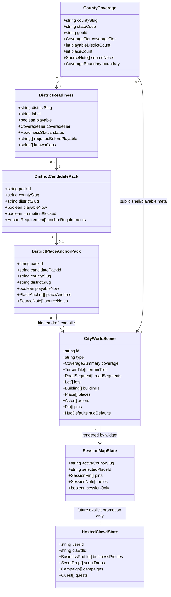
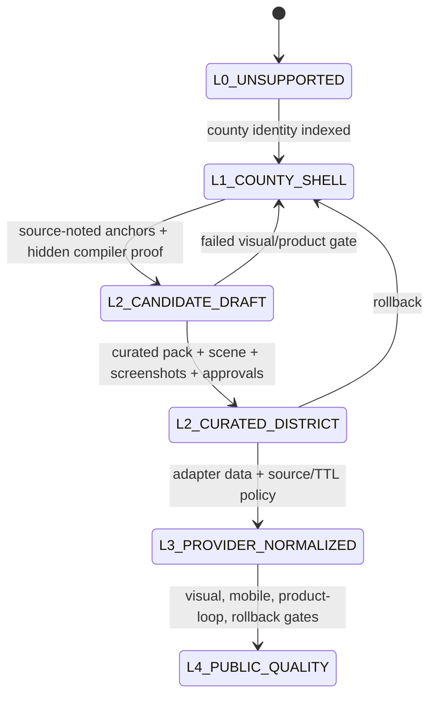
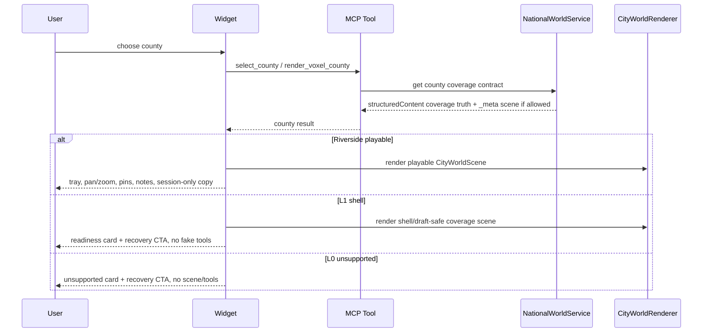
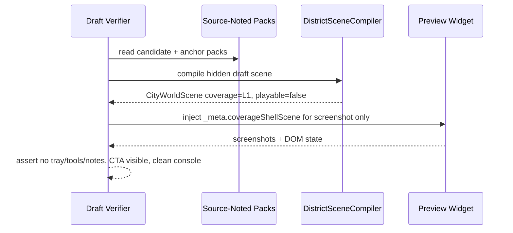
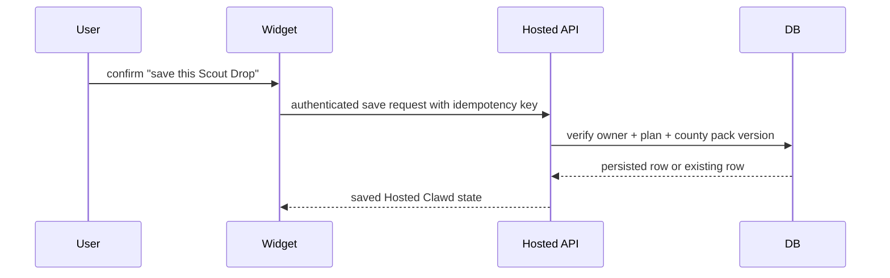

# Atlas Product Backend UML Spec

Status: E12 planning and implementation bridge.

Owner:
Mira for product surface and human comprehension. Forge for backend contracts,
split safety, and implementation readiness. Axiom keeps final architecture and
release authority.

Purpose:
Stop treating the map as only an art problem. Atlas needs a clean product/backend
shape for coverage, draft districts, session-only interaction, and future
persistence. This spec defines the minimum system shape without exposing fake
playability or reopening paid persistence.

## Product Boundary

Current public product:

- Riverside/Eastvale is the only playable loop.
- Orange/Anaheim may exist as L1 shell and hidden draft evidence only.
- Unknown counties are L0 unsupported.
- Pins, stickers, and notes are session-only in the public Alpha/Engine Beta.
- No public product claim may imply saved state, durable memory, XP, evidence,
  automation, provider-normalized coverage, or paid access.

Current backend truth:

- County and district readiness is server-owned.
- Large scene payloads live in `_meta`; concise truth lives in
  `structuredContent`.
- The frontend can render a shell or draft scene, but cannot promote a county
  to playable.
- Hidden draft scenes are evidence artifacts, not product routes.

## UML Class Model

## Coverage State Machine

Rules:

- L2 candidate draft is not a public product tier. It is an internal proof
  stage for Anaheim-style work.
- Only `L2_CURATED_DISTRICT` may expose selected-place tools, sticker tools,
  note input, and a playable product loop.
- Shell and unsupported states must always show one recovery action back to the
  current playable Riverside/Eastvale loop.

## Public County Selection Flow

## Hidden Anaheim Draft Flow

Rules:

- The draft flow must not create a public route.
- The draft flow must not change county switcher choices.
- The draft flow must not expose saved state, session tools, or place actions.
- The draft scene may contain visual anchors, but product claims remain
  shell-only until promotion gates pass.

## Future Persistence Boundary

Persistence is a separate lane. The public session loop cannot quietly become
Hosted Clawd state.

Minimum future tables from `DATABASE_SCHEMA_BETA.md`:

- `users`
- `clawds`
- `business_profiles`
- `county_packs`
- `scout_drops`
- `campaigns`
- `quests`
- `evidence`
- `xp_events`
- `usage_events`

Do not implement these from this spec without a fresh persistence approval.

## Product Backend Responsibilities

Frontend owns:

- map-first UI;
- session-only pins and notes;
- county switcher presentation;
- screenshot-verifiable product behavior;
- no fake tool affordances in shell states.

Backend/core owns:

- county/district coverage truth;
- candidate/readiness metadata;
- source notes and provider boundaries;
- scene compiler contracts;
- future persisted ownership and idempotency.

Forge should own next:

1. A small typed boundary doc or test that proves a county result cannot expose
   playable tools unless `coverageTier === "L2_CURATED_DISTRICT"` and
   `playableDistrictCount > 0`.
2. A backend-facing DTO split between public coverage state, hidden draft scene
   evidence, and future persisted Hosted Clawd state.
3. A no-database persistence readiness map that aligns current Engine Beta
   contracts with `DATABASE_SCHEMA_BETA.md` without creating migrations.

Mira should own next:

1. Reduce the shell/draft UI to a cleaner map-native state without hiding the
   recovery action.
2. Keep browser verifiers focused on user comprehension: no fake tools, no
   overflow, clean console, session-only copy, and readable mobile first screen.
3. Reject any Anaheim promotion that still relies on labels to identify
   objects.

## Cutline

If a change does not improve one of these, it is probably not the next move:

- clearer county readiness;
- stronger map-first comprehension;
- safer backend boundary;
- less fake playability;
- better desktop/mobile proof.

Everything else should wait.
