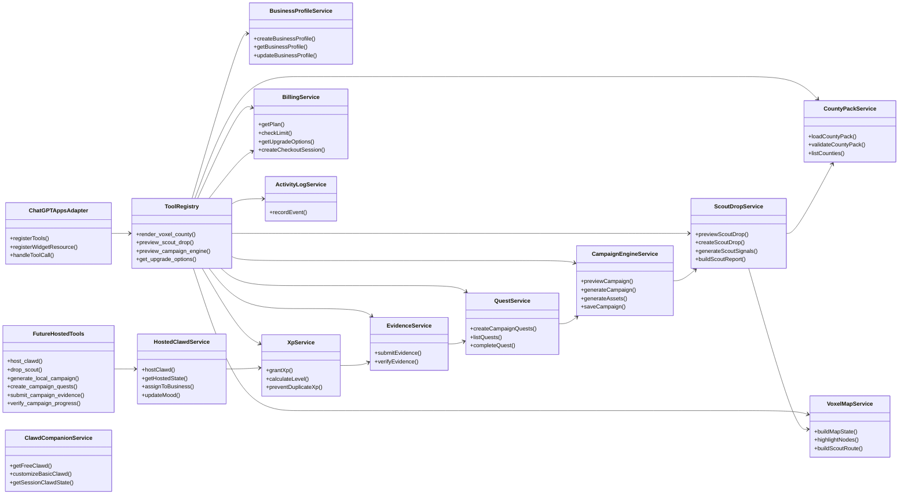
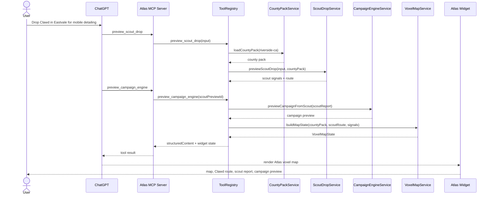

# Atlas Backend UML

## High-level architecture

```mermaid
classDiagram
    direction LR

    class ChatGPTAppsAdapter {
      +registerTools()
      +registerWidgetResource()
      +handleToolCall()
    }

    class ToolRegistry {
      +render_voxel_county()
      +preview_scout_drop()
      +preview_campaign_engine()
      +get_upgrade_options()
    }

    class FutureHostedTools {
      +host_clawd()
      +drop_scout()
      +generate_local_campaign()
      +create_campaign_quests()
      +submit_campaign_evidence()
      +verify_campaign_progress()
    }

    class CountyPackService {
      +loadCountyPack()
      +validateCountyPack()
      +listCounties()
    }

    class VoxelMapService {
      +buildMapState()
      +highlightNodes()
      +buildScoutRoute()
    }

    class ClawdCompanionService {
      +getFreeClawd()
      +customizeBasicClawd()
      +getSessionClawdState()
    }

    class HostedClawdService {
      +hostClawd()
      +getHostedState()
      +assignToBusiness()
      +updateMood()
    }

    class ScoutDropService {
      +previewScoutDrop()
      +createScoutDrop()
      +generateScoutSignals()
      +buildScoutReport()
    }

    class CampaignEngineService {
      +previewCampaign()
      +generateCampaign()
      +generateAssets()
      +saveCampaign()
    }

    class BusinessProfileService {
      +createBusinessProfile()
      +getBusinessProfile()
      +updateBusinessProfile()
    }

    class QuestService {
      +createCampaignQuests()
      +listQuests()
      +completeQuest()
    }

    class EvidenceService {
      +submitEvidence()
      +verifyEvidence()
    }

    class XpService {
      +grantXp()
      +calculateLevel()
      +preventDuplicateXp()
    }

    class BillingService {
      +getPlan()
      +checkLimit()
      +getUpgradeOptions()
      +createCheckoutSession()
    }

    class ActivityLogService {
      +recordEvent()
    }

    ChatGPTAppsAdapter --> ToolRegistry
    ToolRegistry --> CountyPackService
    ToolRegistry --> VoxelMapService
    ToolRegistry --> ScoutDropService
    ToolRegistry --> CampaignEngineService
    ToolRegistry --> BillingService
    FutureHostedTools --> HostedClawdService
    ToolRegistry --> BusinessProfileService
    ToolRegistry --> QuestService
    ToolRegistry --> EvidenceService
    ToolRegistry --> XpService
    ToolRegistry --> BillingService
    ToolRegistry --> ActivityLogService

    ScoutDropService --> CountyPackService
    ScoutDropService --> VoxelMapService
    CampaignEngineService --> ScoutDropService
    QuestService --> CampaignEngineService
    EvidenceService --> QuestService
    XpService --> EvidenceService
    HostedClawdService --> XpService
```

## Runtime flow

```mermaid
sequenceDiagram
    actor User
    participant ChatGPT
    participant MCP as Atlas MCP Server
    participant Tools as ToolRegistry
    participant County as CountyPackService
    participant Scout as ScoutDropService
    participant Campaign as CampaignEngineService
    participant Map as VoxelMapService
    participant Widget as Atlas Widget

    User->>ChatGPT: Drop Clawd in Eastvale for mobile detailing
    ChatGPT->>MCP: preview_scout_drop
    MCP->>Tools: preview_scout_drop(input)
    Tools->>County: loadCountyPack(riverside-ca)
    County-->>Tools: county pack
    Tools->>Scout: previewScoutDrop(input, countyPack)
    Scout-->>Tools: scout signals + route
    ChatGPT->>MCP: preview_campaign_engine
    MCP->>Tools: preview_campaign_engine(scoutPreviewId)
    Tools->>Campaign: previewCampaignFromScout(scoutReport)
    Campaign-->>Tools: campaign preview
    Tools->>Map: buildMapState(countyPack, scoutRoute, signals)
    Map-->>Tools: VoxelMapState
    Tools-->>MCP: structuredContent + widget state
    MCP-->>ChatGPT: tool result
    ChatGPT-->>Widget: render Atlas voxel map
    Widget-->>User: map, Clawd route, scout report, campaign preview
```
