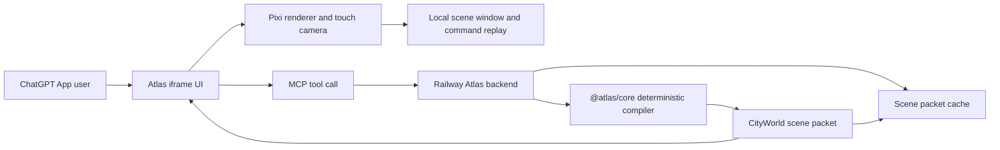

# Atlas Voxel Engine Delivery Architecture - 0.70H

Atlas should not keep growing one giant generator file. The current engine has a usable foundation, but the responsibilities are too collapsed: data identity, layout generation, visual grammar, scene enrichment, command-window budgeting, and app delivery are close enough that every quality pass risks turning into a broad rewrite.

## Current Diagnosis

| Area | Current signal | CTO read |
| --- | ---: | --- |
| `packages/core/src/voxel/cityWorldCompiler.ts` | ~77 KB | Too much enrichment and scene construction in one file. Split before adding more visual families. |
| `packages/core/src/voxel/cityWorldDiagnostics.ts` | ~42 KB | Acceptable as audit logic, but should stay out of renderer/runtime paths. |
| `packages/core/src/voxel/cityWorldParametricGenerator.ts` | ~30 KB | Useful seam, but it mixes spec expansion, parcel layout, building pools, props, camera presets, and sample fixture. |
| `packages/core/src/world/usCountyIndex.ts` | ~244 KB | Large but generated data. Keep generated and source-verified; do not hand-edit. |
| `packages/core/src/voxel/cityWorldGeneratedDistrict*.ts` | split 0.70H seam | New deterministic district work is separated into types, seed, archetypes, and orchestrator. |

## Boundary



## What Stays Local

- Pan, zoom, tap hit testing, hover/touch feedback, camera easing, and command replay stay in the browser iframe.
- The client owns the retained scene graph for the active packet. No network request should be required for normal map movement.
- The client may request the next window or district packet, but the current view must remain usable while that happens.
- The client should not run provider lookup, payment checks, policy gates, or broad county generation loops.

## What Moves To Railway

- Compile requested county/district packets from typed contracts.
- Cache packet results by county, district, generator version, viewport profile, LOD profile, and asset manifest version.
- Return small `structuredContent` summaries and put renderer-heavy data in `_meta`.
- Normalize provider lookups into source-noted anchors only after category, attribution, cache, and policy gates pass.
- Run background precompile jobs for likely next districts, but never create public playable claims without proof.

Railway should not be in the frame loop. If panning or zooming waits on Railway, Atlas will feel broken on mobile.

## Packet Contract Direction

The next service packet should look like this conceptually:

```ts
type CityWorldScenePacket = {
  type: "cityWorldScenePacket";
  packetKey: string;
  coverageTier: "L1_COUNTY_SHELL" | "L2_CURATED_DISTRICT" | "L3_PROVIDER_NORMALIZED" | "L4_PUBLIC_QUALITY";
  playable: boolean;
  generatorVersion: string;
  assetManifestVersion: string;
  sceneSummary: {
    countySlug: string;
    districtSlug: string;
    label: string;
    commandCount: number;
    chunkCount: number;
  };
  initialWindow: CityWorldSceneWindow;
  chunkIndex: CityWorldSceneChunkIndex;
  promotionBlockers: string[];
};
```

For ChatGPT tools:

- `structuredContent`: county label, coverage tier, playable boolean, packet key, short blockers.
- `_meta`: scene packet, chunk index, initial visible commands, camera presets, asset manifest hints.

## Refactor Plan

1. Split `cityWorldCompiler.ts` into terrain, roads, lots, buildings, props, and shared metadata decorators.
2. Split `cityWorldParametricGenerator.ts` into terrain expansion, parcel layout, building pools, prop/camera helpers, and fixture specs.
3. Keep generated district generation in the 0.70H split modules: types, seed, archetypes, orchestrator.
4. Add a Railway-backed scene packet service that calls `@atlas/core`, caches packets, and returns windowed scene data.
5. Replace the client-side synthetic preview call with a service-backed packet request once the packet service is verified.

## Production Rules

- Public map motion must stay local.
- Provider lookup must never directly create renderer geometry.
- Generated districts remain non-playable until provider anchors, screenshots, and owner acceptance pass.
- No giant county payloads in `structuredContent`.
- No new public MCP tools for this slice.
- No DB/Auth/Stripe expansion for engine delivery work.

## 0.70H Status

0.70H implements the first part: deterministic generated district specs from Census county identity only. It does not implement the Railway packet service yet. The recommended next slice is `0.71H Scene Packet Service Boundary / Railway Cache Plan`.
