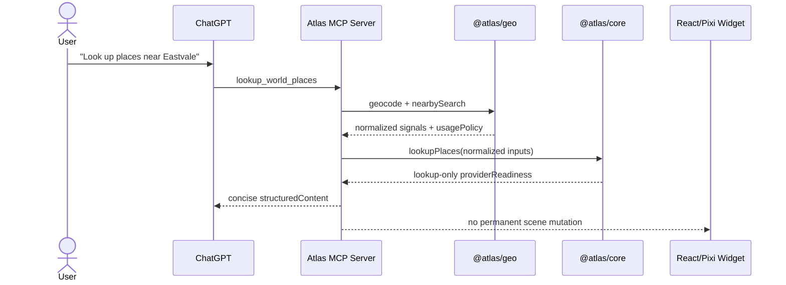
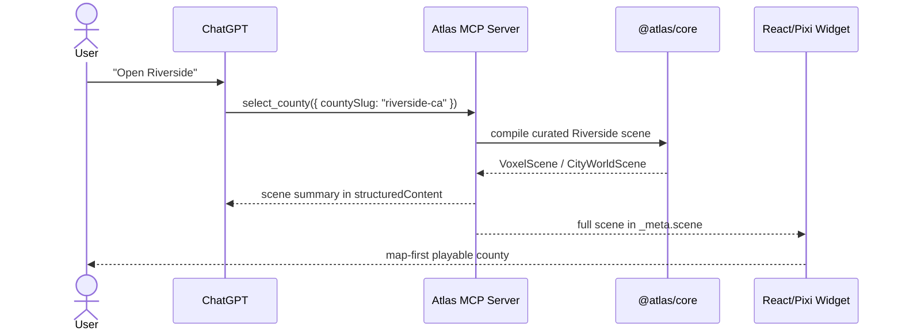
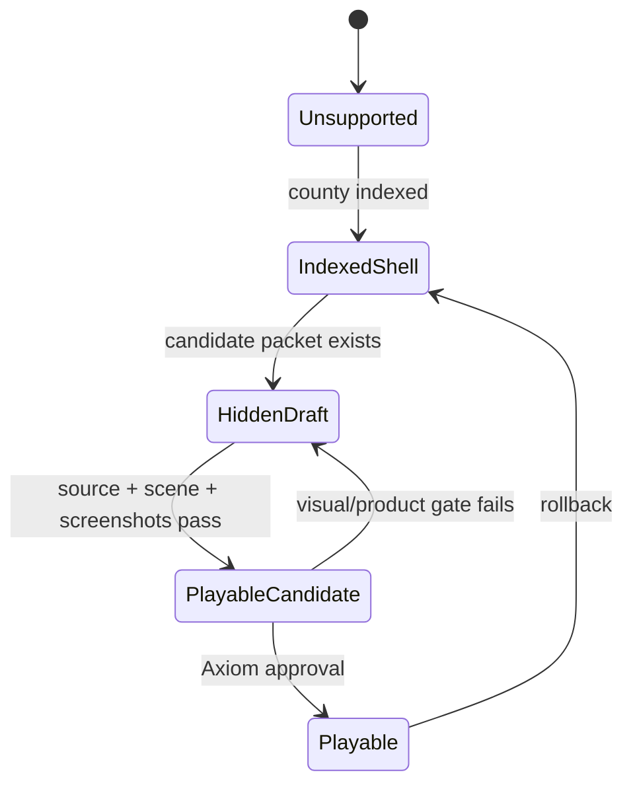

# Atlas Runtime Pipelines

## Provider Lookup

```mermaid
sequenceDiagram
  actor User
  participant ChatGPT
  participant Server as Atlas MCP Server
  participant Geo as @atlas/geo
  participant Core as @atlas/core
  participant Widget as React/Pixi Widget

  User->>ChatGPT: "Look up places near Eastvale"
  ChatGPT->>Server: lookup_world_places
  Server->>Geo: geocode + nearbySearch
  Geo-->>Server: normalized signals + usagePolicy
  Server->>Core: lookupPlaces(normalized inputs)
  Core-->>Server: lookup-only providerReadiness
  Server-->>ChatGPT: concise structuredContent
  Server-->>Widget: no permanent scene mutation
```

## Playable County Render

```mermaid
sequenceDiagram
  actor User
  participant ChatGPT
  participant Server as Atlas MCP Server
  participant Core as @atlas/core
  participant Widget as React/Pixi Widget

  User->>ChatGPT: "Open Riverside"
  ChatGPT->>Server: select_county({ countySlug: "riverside-ca" })
  Server->>Core: compile curated Riverside scene
  Core-->>Server: VoxelScene / CityWorldScene
  Server-->>ChatGPT: scene summary in structuredContent
  Server-->>Widget: full scene in _meta.scene
  Widget-->>User: map-first playable county
```

## Readiness State

```mermaid
stateDiagram-v2
  [*] --> Unsupported
  Unsupported --> IndexedShell: county indexed
  IndexedShell --> HiddenDraft: candidate packet exists
  HiddenDraft --> PlayableCandidate: source + scene + screenshots pass
  PlayableCandidate --> Playable: Axiom approval
  PlayableCandidate --> HiddenDraft: visual/product gate fails
  Playable --> IndexedShell: rollback
```
