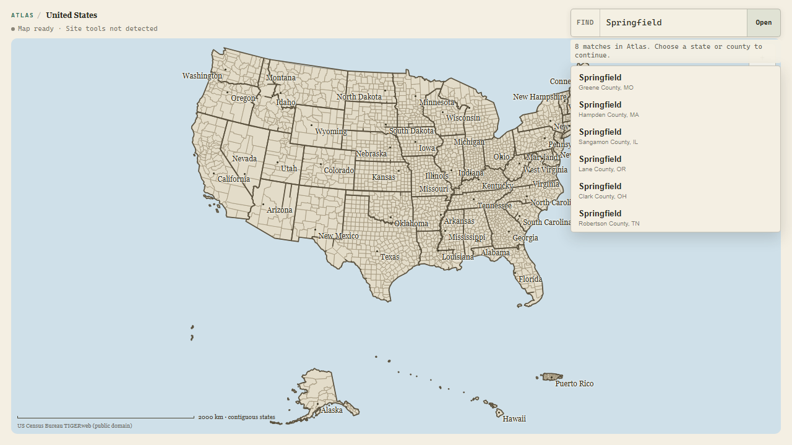
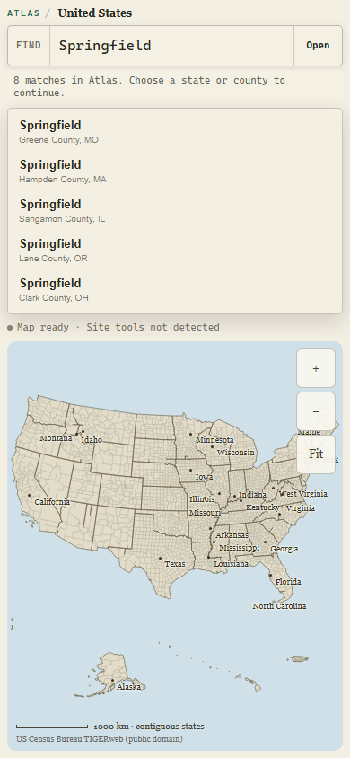
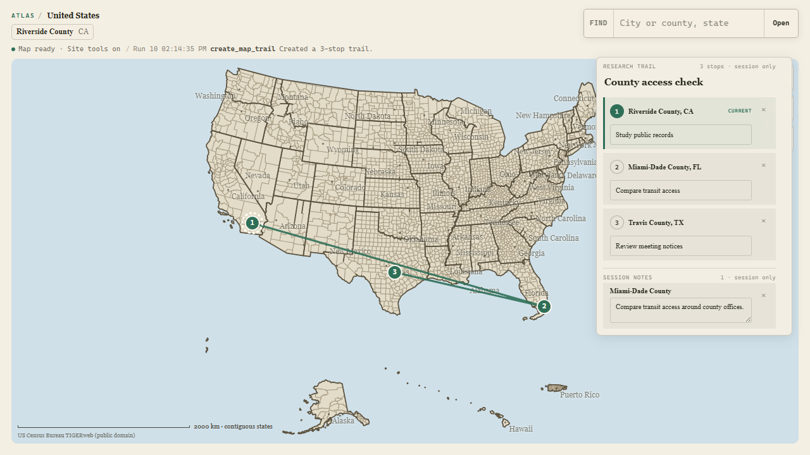

# ChatGPT E2E product audit

Audit date: August 30, 2026

Surface: standalone Atlas `/explore` route at 1280x720 and 390x844

Goal: confirm that the human-facing map remains legible while ChatGPT reads and changes the same session through page-native WebMCP.

## Verdict

The flow is coherent and map-first. Atlas opens as a usable geographic workspace before Site Tools are available, ambiguity is handled in context rather than in a detached dialog, and the three-stop tool result becomes a clear national route with an editable rail. The E2E harness now mirrors that hierarchy: one URL, one visible page, one protocol path, and explicit external gates for real ChatGPT and model evidence.

## Steps

### 1. Enter the shared map — healthy

- Strength: the map is the dominant surface; the compact location, readiness line, finder, and zoom controls do not compete with it.
- Strength: `Map ready · Site tools not detected` describes a capable normal-browser state rather than an error.
- Accessibility note: the visible finder label, named controls, and high-contrast focus treatment are backed by keyboard tests; screenshots alone do not prove screen-reader behavior.

### 2. Recover from an ambiguous place — healthy

- Strength: the result count and instruction appear adjacent to the finder, and every candidate includes county/state context.
- Strength: the map stays put, which matches the tool contract and reduces the chance that either the person or ChatGPT mistakes a guess for navigation.
- Trade-off: only the first candidates fit without scrolling. The explicit eight-match count makes that containment understandable; adding a larger panel would cover too much map.

### 3. Reflow the same recovery on mobile — healthy

- Strength: the finder and candidates become the current task, then return the map to the remaining viewport instead of shrinking it into a thumbnail.
- Strength: measured page width is 390 pixels with `scrollWidth` equal to `clientWidth`; no horizontal overflow was present.
- Accessibility note: visible controls retain the 44-pixel mobile floor. Zoom/reflow beyond this viewport still needs real assistive-technology and browser-zoom acceptance.

### 4. Show the completed agent-created trail — healthy

- Strength: the route and numbered markers are the visual centerpiece, while state labels fade back and the rail stays compact.
- Strength: marker numbers, ordered rail rows, and `CURRENT` provide non-color state cues.
- Strength: the activity line names the exact tool and visible effect, which closes the loop between ChatGPT's action and the person's map.
- Evidence limit: this Chrome WebMCP capture proves page/protocol behavior, not Site Tools discovery in the ChatGPT desktop app.

## Highest-impact decisions

1. Keep Site Tools as the primary ChatGPT path. A detached remote MCP mutation session would break the visible shared-canvas promise unless it could bind to the same open page controller.
2. Keep the release report's `ok` and `releaseReady` meanings separate. Automated page/protocol success must not conceal a missing real-ChatGPT transcript or model threshold.
3. Keep ambiguity inline and restrained. The current list preserves geographic context without turning Atlas into a dashboard or modal workflow.

## Evidence limits

The current run proves visual hierarchy, responsive reflow, normal-browser fallback, and real Chrome WebMCP execution. It does not prove ChatGPT desktop discovery, a public HTTPS deployment, the Grok 4.6 score, or full WCAG conformance. Those remain named acceptance gates rather than inferred passes.
