# Atlas WebMCP Product Design Audit

## Audit scope

- Surface: the no-login `/explore` judge route.
- User goal: understand an unfamiliar county with a visible human-agent research trail.
- Accessibility target: keyboard-operable, readable, non-color-dependent interaction at desktop and `390x844` mobile.
- Capture tool: gstack `/browse` against the local production-shaped route on August 30, 2026.

## Step 1 — Enter the national map

Health: **Strong foundation, weak readiness language.**

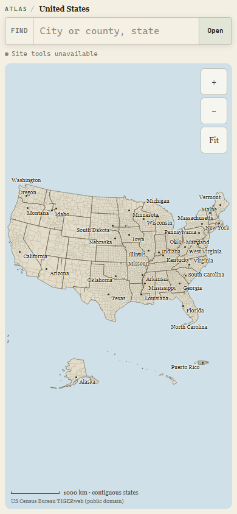

The national map owns the screen immediately, search is obvious, and the restrained paper-and-water palette feels specific to Atlas. The phrase `Site tools unavailable` reads like a product failure before the user has done anything. On mobile, controls remain 44px and the map is still the dominant object.

## Step 2 — Resolve an ambiguous Springfield

Health: **Safe and usable, but too technical.**

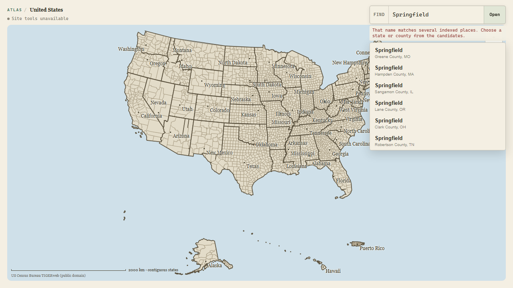

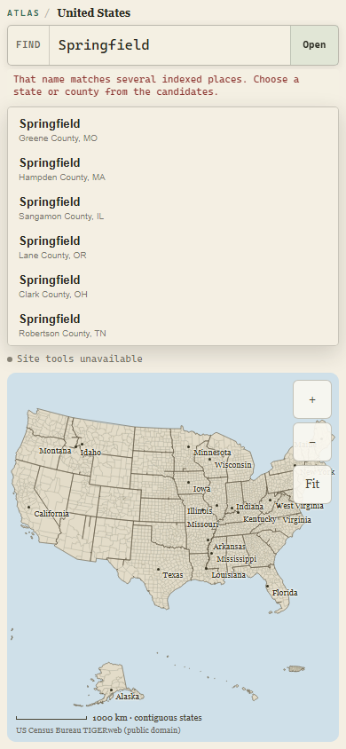

Atlas correctly refuses to guess and exposes eight keyboard-operable candidates. The original feedback sentence sounds like index/debug language, and the mobile result stack takes more vertical space than it needs before the map resumes.

## Step 3 — Review and edit a completed trail

Health: **Memorable map result, under-designed workbench.**

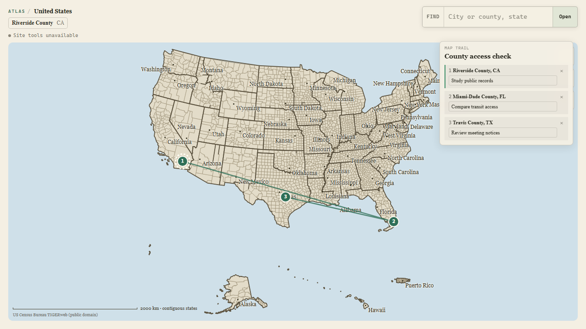

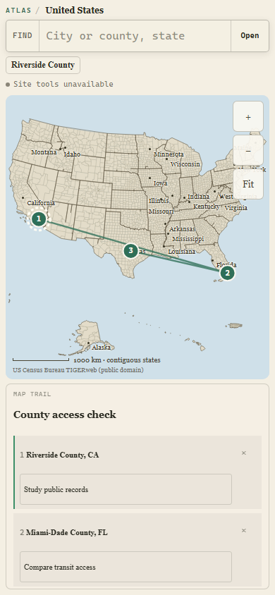

The numbered cross-country route is the clearest expression of the product thesis. The rail does not explain that its state is session-only, the active row relies mainly on a green rule, and desktop place/edit/remove targets measure roughly 13–22px high. Mobile targets expand to 44px, but only part of a three-stop trail is visible, so the rail needs an explicit stop count and clearer scroll context.

## Highest-impact changes

1. Replace negative fallback language with a calm map-ready state that still discloses whether site tools were detected.
2. Make the trail header say what it is, how many stops it contains, and that it is session-only.
3. Echo map marker numbers in the rail and label the current stop in text, not color alone.
4. Raise desktop editing targets to at least 32px while preserving 44px mobile targets.
5. Reduce map-label competition when a trail is present and strengthen the connecting line slightly.
6. Shorten ambiguity feedback and cap the mobile candidate stack before it crowds the map.

## Evidence limits

Screenshots support visual hierarchy, responsive layout, and apparent target-size findings. Keyboard behavior and programmatic names were checked through the current accessibility tree, but this audit does not claim full WCAG conformance or screen-reader acceptance. The trail state was created through the same live `AtlasMapController` used by the product so the captured UI was not a static mock.

## Implemented pass

Health after implementation: **Ready for release review.**

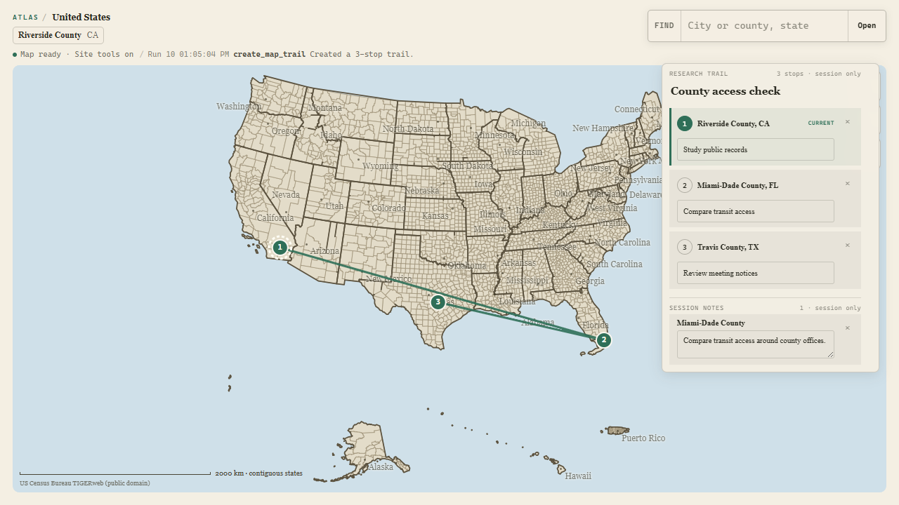

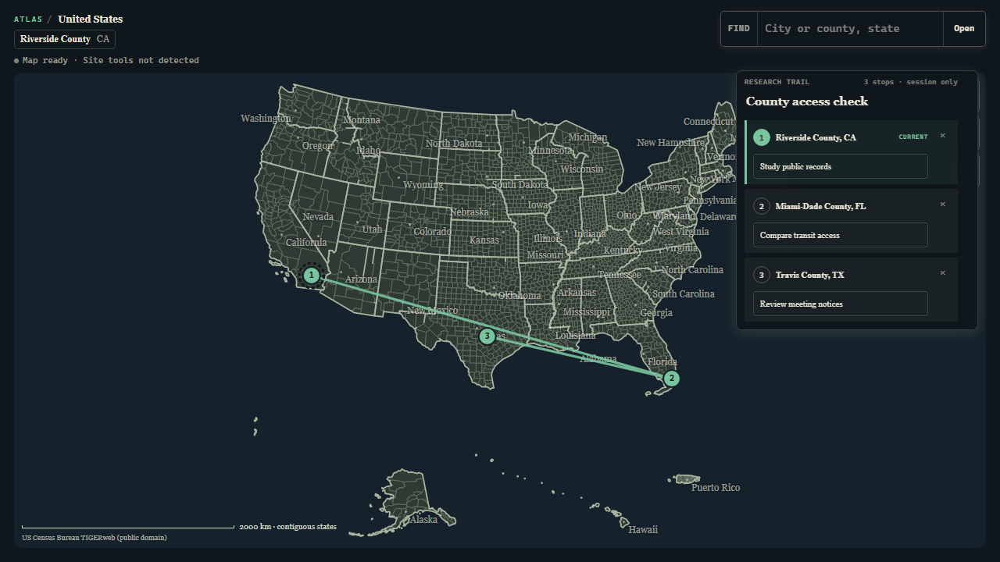

The pass keeps the original silhouette and changes only the session workbench around it. The fallback now begins with `Map ready`; supported Chrome shows `Site tools on` followed by the real tool, run number, time, and effect. Trail rows echo the map markers, expose `Current` in text and `aria-current="step"`, and state the stop count and session boundary before any editing.

Measured browser results:

- Desktop trail title, place, prompt, and remove controls are at least 32px high instead of roughly 13–22px.
- Mobile trail and map controls remain 44px.
- The `390x844` page remains `scrollWidth=clientWidth=390`.
- The mobile ambiguity list ends on a complete fifth row while the eight-match count explains that more choices remain.
- Keyboard focus is visible in both light and dark palettes; Enter on the active rail stop opens the county through the shared controller.
- Chrome 152 WebMCP discovers exactly five tools and captures the completed trail only after the visible route, rail, activity, and note exist.

## Cognitive-accessible human-agent pass — August 30, 2026

### Flow 1 — Enter and orient

Health: **Strong.** The first screen still belongs to the national map. The pass reuses the existing paper, water, serif, and mono system without adding a new panel, badge, or visual language.

### Flow 2 — Resolve an ambiguous place

Health: **Strong and mutation-safe.** Springfield still returns eight candidates next to the search control. Progress now says `Searching Atlas` instead of `Wait`, and candidate rows use a 180ms ease-out with a 24ms stagger. The list remains bounded and keyboard-operable.

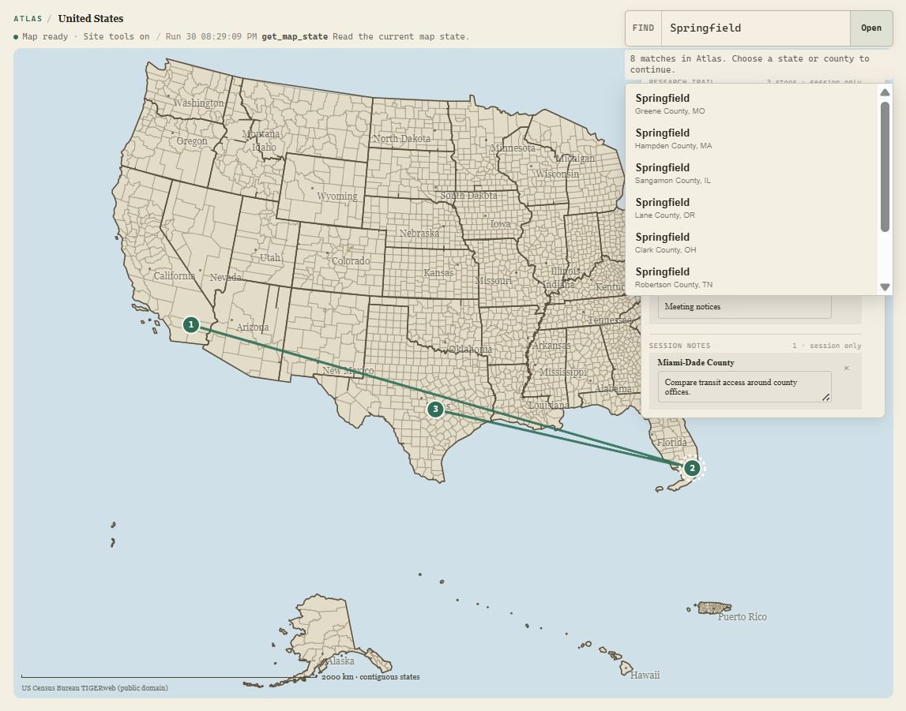

### Flow 3 — See what ChatGPT changed

Health: **Improved.** Visible activity now reads `Agent` plus the human effect. Run number, raw tool name, state, and time remain in the diagnostic title instead of competing with the result. The same shared-map state is shown on both sides below; only the activity language and implementation under review changed.

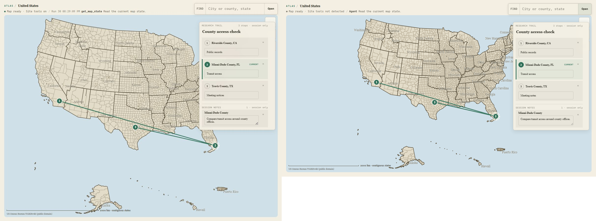

### Flow 4 — Use and edit a trail on mobile

Health: **Strong.** At exactly `390x844`, the map is 403px tall and the research rail is 292px tall. The current stop exposes one 44px prompt editor and one 44px removal action. The two inactive stops retain their place and one-line research prompt without exposing six simultaneous controls. The page remains `scrollWidth=clientWidth=390`.

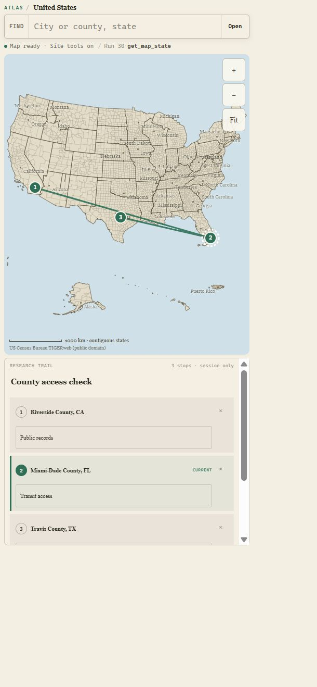

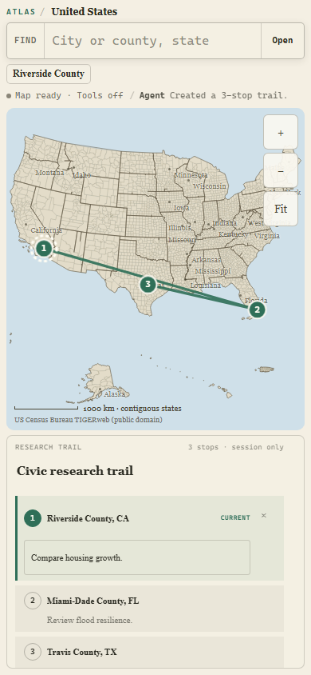

Opening inactive stop 2 made Miami-Dade County current, exposed only `Review flood resilience.` and its removal action, and entered the county through the existing `openTrailStop` controller path.

### Flow 5 — Follow visible continuity

Health: **Purposeful and bounded.** The route draws once in 440ms. Markers arrive in order with 70ms stagger and 220ms duration. The current ring enters once in 180ms. Button press feedback moves one pixel. No effect loops, floats, pulses, or delays tool completion.

`document.getAnimations()` confirmed the named route, marker, pin, active-ring, and activity effects with those exact durations and delays. The reduced-motion rule removes all six animation families and keeps their final visible styles as the defaults.

### Evidence limits

The local browser did not expose experimental Site Tools, so the current-run visual state was created through the same live `AtlasMapController` methods used by the five descriptors. This proves the interface and shared state path, not a new ChatGPT transcript. Exact-five Chrome WebMCP execution remains covered by the existing deterministic browser smoke evidence. The pass does not claim WCAG or ASD-STE100 conformance.
