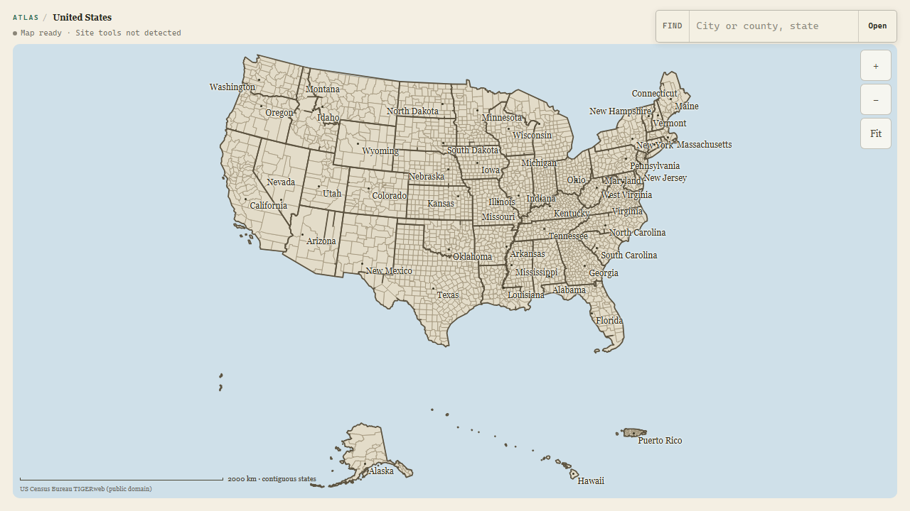
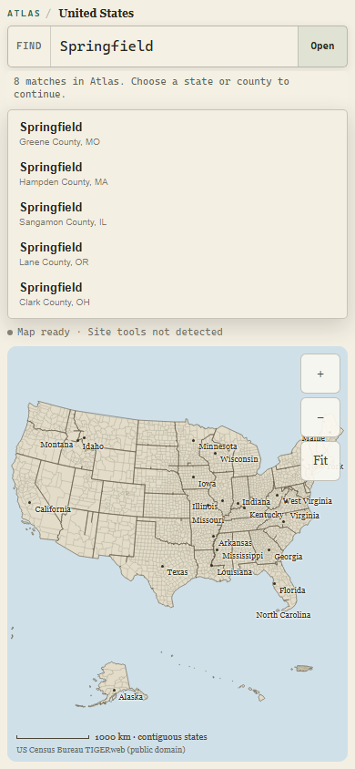
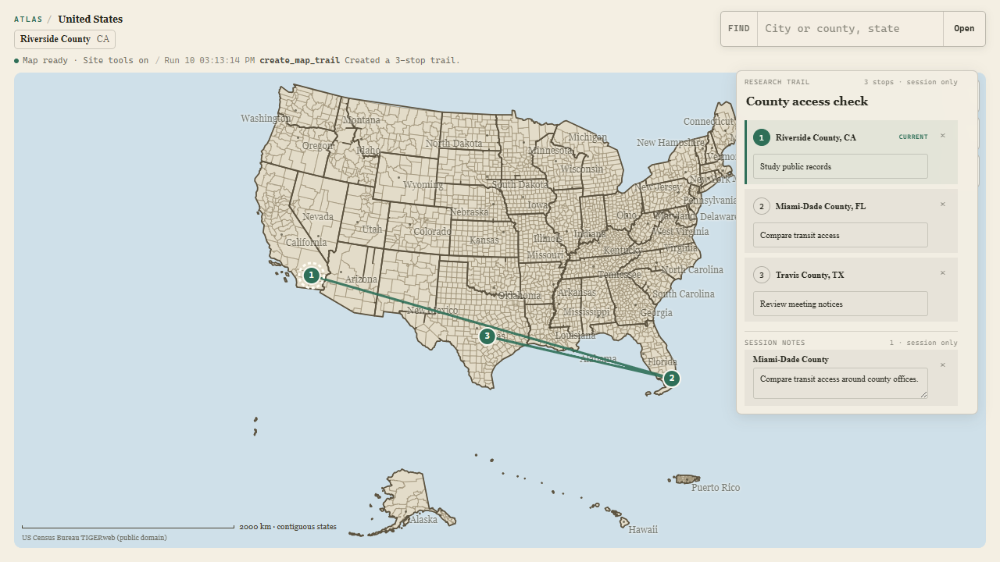

# Live release product-design audit

**Run:** August 30, 2026

**Inspected runtime:** `cc45be38d2bb9d48ca3eb498bf6671b025f226ff`

**Final deployed candidate:** `986cf864927219f5f269a04b21a96f8440988cba` (documentation-only delta; identical runtime bundle)

**Surface:** [public `/explore` route](https://atlas-webmcp-production.up.railway.app/explore)

**Mode:** combined UX and screenshot-bounded accessibility audit

## Verdict

The live release preserves the right product hierarchy: the map owns the screen, search is the one persistent human action, ambiguity is resolved in place, and the agent's strongest write becomes a visible national route instead of a detached chat result. No high- or medium-severity design change is required before the real ChatGPT acceptance run.

## Flow

### 1. Enter the shared national map — healthy

The national silhouette is immediate and dominant. The compact Atlas/location line, finder, and map controls form one restrained operating surface. The normal-browser status is honest without presenting the product as broken.

### 2. Recover from an ambiguous Springfield — healthy

Eight candidates appear directly under the finder with county and state disambiguation. Nothing on the map changes before a candidate is selected. The panel is dense but scannable and stays subordinate to the map.

### 3. Resolve ambiguity at 390 × 844 — healthy

Search and recovery move above the map instead of crushing it into a side column. The page measured `scrollWidth = clientWidth = 390`; no horizontal overflow appeared. Five candidates remain visible while the panel scrolls for the rest, and the map keeps a usable full-width canvas.

### 4. Create a three-county WebMCP trail — healthy and distinctive

The tool-created result is unmistakably visible: one route, three numbered markers, matching rail numbers, editable prompts, session notes, and a concise activity line. The current stop uses number, text, border, and fill rather than color alone. The rail overlaps the least important map area while preserving the route and national context.

## Strengths

- The human and agent experience reads as one product, not a map plus chatbot.
- The three-stop route is the strongest visual and makes WebMCP's value legible without narration.
- Ambiguity is a deliberate choice state rather than an error or silent guess.
- Mobile prioritizes recovery text and touch controls before map detail.
- Copy is concise, factual, and free of generic product language.

## Risks and evidence limits

- The dense county/state labeling is intentionally cartographic, but small labels are not a substitute for accessible names. The current DOM snapshot exposed named finder and zoom controls; full screen-reader behavior still needs the real client acceptance pass.
- Screenshots confirm visible focus hierarchy, non-color current-stop treatment, and responsive reflow. They do not prove contrast ratios, assistive-technology announcements, or every keyboard transition.
- A normal browser correctly says `Site tools not detected`; only ChatGPT's built-in browser can prove the final discovery treatment users will see there.

## Recommendations

1. Keep the national trail overview as the demo opening frame and submission thumbnail.
2. In ChatGPT, start with trail creation, then click marker 2 manually and ask the agent to read the same state.
3. Do not add explanatory panels or more map labels before submission; they would compete with the shared-canvas proof.
4. Treat the real ChatGPT transcript, not another visual redesign, as the next product-design gate.
