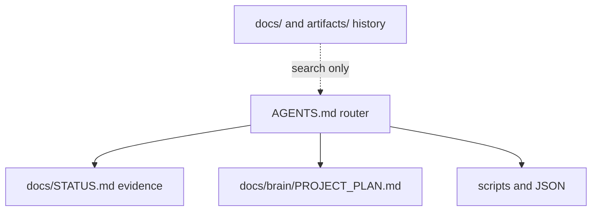

# Authority Split

Atlas broke when every document restated the tool list and agents followed
the loudest stale page. The rule now: **no prose restates a machine-checkable
fact.** If a script can check it, link the script.

## Who owns what

| Kind | Owner |
|---|---|
| Permanent boundaries and routing | `AGENTS.md` |
| Last-run evidence and blockers | `docs/STATUS.md` |
| Priorities and recorded decisions | `docs/brain/PROJECT_PLAN.md` |
| Tool names, counts, SHAs, URLs | code, JSON, or a command |
| Document classification | `scripts/lib/atlas-document-policy.mjs` |
| Visual direction | `DESIGN.md` (active reference, not ship authority) |

Local GBrain (`docs/brain/README.md`) inventories every visible document and
labels it canonical, active-reference, generated, review-required, or
historical. Query with `pnpm brain:query -- "terms"`. Do not promote an old
title by citing it.

Notion is an optional human mirror (`docs/brain/notion.json`). Work does not
block when Notion or MCP memory is down.

## Related

- [[Hard_Stops]]
- [[Current_Product]]
