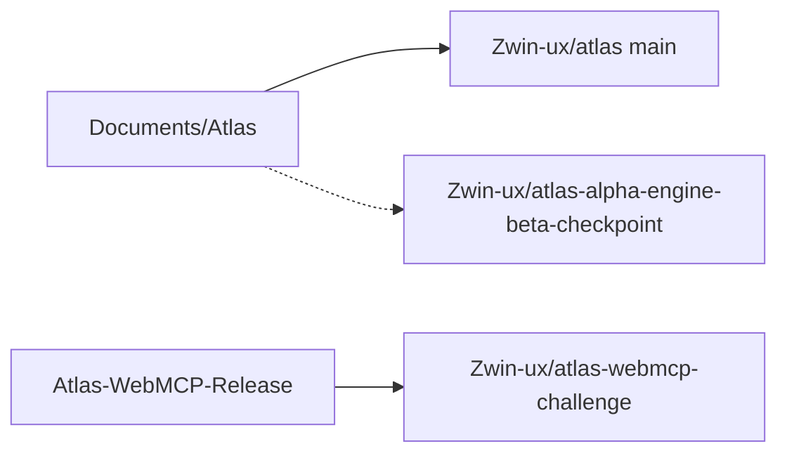

# Repository Map

Three GitHub remotes, one current product.

- **Current product:** [Zwin-ux/atlas](https://github.com/Zwin-ux/atlas), local
  `C:\Users\mzwin\Documents\Atlas` on `main`. ChatGPT should start here.
- **WebMCP challenge snapshot:** private frozen candidate at
  `97792d84`. Do not treat it as the ChatGPT-app tree.
- **Voxel checkpoint:** historical. Default branch is
  `codex/engine-beta-cleanup`, not current product.

Many `Documents/Atlas-*` folders are git worktrees of the same object store.
They are named slices, not extra products. Details: repo-root `GITHUB.md`.

## Related

- [[Current_Product]]
- [[ChatGPT_Apps_SDK]]
